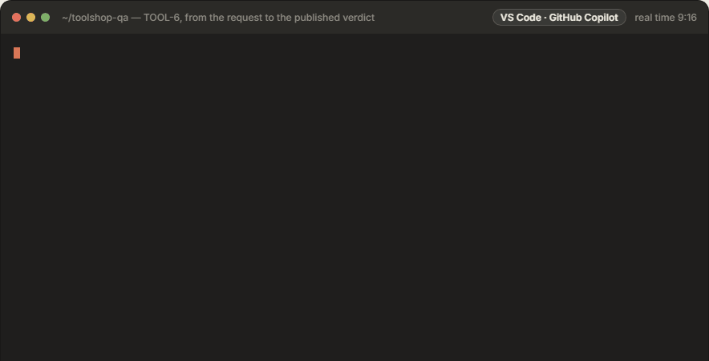

# Held-out Evaluator — an AI agent skill

Works in GitHub Copilot (VS Code agent mode) or Claude Code. The examples say "Opus" for the AI model doing the work.

A project skill ([.github/skills/heldout-evaluator](.github/skills/heldout-evaluator/SKILL.md)) that
evaluates a Jira story against any web application or API using **held-out** Playwright tests,
written from the requirement alone:

```
Jira story (title, description, acceptance criteria) + the screenshots they show + the Confluence pages they link
  → requirement contract: built by a subagent from any story format, every item cited to source lines,
    every line accounted for, every expected value grounded — then checked by an independent reviewer subagent
  → Playwright UI/API tests straight from the contract (criteria, test type and source on every test),
    their steps on the app's reusable journeys → freeze → harden vs the live AUT
  → run → triage (script defect vs application defect, reproduced live) → repair & re-run
  → verdict.md (traceability, reproduction steps, evidence) → Jira comment + attachment → you decide
  → journey registry: the journeys the passing tests proved, for the next story (never what the app answers)
```

Two folders in your project hold the work:

```
journeys/fixtures/<domain>.ts   reusable journeys, UI and API, one file per area of the app (products.ts, favorites.ts…)
journeys/registry.yml           each journey's id and file, what it touches, what must run before it, which story proved it
output/<app>/<KEY>/             everything of one story: requirement, contract, tests, runs, verdict
```

**The Held-out Evaluator guide:** [docs/heldout-evaluator.html](docs/heldout-evaluator.html) explains every capability with diagrams, plain-English
summaries, terminal replays and recordings of the tests driving a real app. Git hosts show HTML as source,
so open it from a clone (or a Pages site) in a browser.

## Adopt it in another project (about 1 minute)

Clone the skill once, from its GitLab repository. Then run its setup script in the folder of the project that will
hold the tests (a new, empty folder is fine):

```powershell
git clone --depth 1 <skill-repository-url> "$HOME/heldout-skill"
& "$HOME/heldout-skill/setup.ps1" -BaseUrl https://your-app
```

```bash
git clone --depth 1 <skill-repository-url> "$HOME/heldout-skill"
"$HOME/heldout-skill/setup.sh" --base-url https://your-app
```


`setup.ps1` is for PowerShell, `setup.sh` for bash and zsh (Git Bash on Windows too). If PowerShell refuses to run
scripts, run it as `powershell -ExecutionPolicy Bypass -File "$HOME/heldout-skill/setup.ps1" -BaseUrl https://your-app`.
Setup pulls the clone, checks Node (20.11 or newer), runs the skill's `init --install` and then `doctor`. Pass
`-Project <folder>` (`--project`) to set up another folder than the current one, and anything `init` takes after it
(`--api-base-url https://api.your-app`, `--name "Your App"`).

`init` first runs the skill repository's `update`, which copies the files as they are in the skill repository, to the
same paths (there are no templates): the skill into `.github/skills/heldout-evaluator/`,
its scripts into `.github/scripts/` (next to any scripts of your own there, never over one), the subagents into
`.github/agents/` (with bridges in `.claude/` for Claude Code), the Playwright MCP server into `.vscode/mcp.json` and the
root `.mcp.json` (added to any servers you already have; nothing of yours is removed), and `playwright.config.ts`, `tsconfig.json`,
`.env.example` and `heldout-support/fixtures.ts`. A file your project already has is kept. `init` then sets the project
up from its own copy of the scripts (config, `.env`, the npm script, `.gitignore`), visits your app once and fills in the
profile:
- the profile id, from the host name (from the page title for localhost or an IP address);
- the app's name, from its page title (shown in verdicts);
- the test-id attribute the app renders;
- the API host, when the web app calls an API on another host;
- `blockHosts`, the ad and analytics networks the page loads.

Add `-Ci gitlab` (`--ci gitlab`) for a GitLab CI regression pipeline. Setup ends with `doctor`: it checks Node,
dependencies, the browser, config, reachability, Jira, subagents, secrets (including any secret value that has slipped
into a file git would commit), the accounts recipe and the journeys, and every problem comes with the command that
fixes it. Then:

1. Reload VS Code once (or start a new Claude Code session), so the agent loads the Playwright MCP server and the
   subagents.
2. Ask GitHub Copilot (agent mode) or Claude Code: **"Run a held-out evaluation of ABC-123"**.

**It runs unattended.** Questions are asked once, during setup (the application's address, Jira, test accounts). From
the moment a story is fetched to its published verdict, the agent asks you nothing and waits for nothing: what the
story leaves unclear is tested as far as it can be and listed in the verdict as an open question for the story's
owner, a story with no acceptance criteria gets an INCONCLUSIVE verdict that says so, and tests that need an account
or a secret the project doesn't have end BLOCKED, with what is missing named in the verdict. One command carries a
story between the subagents: `npm run heldout -- advance ABC-123` runs every script step that comes next and names
the subagent whose turn it is. The verdict is published to the story when it is ready; set `"publish": "manual"`
under `jira` in `heldout.config.json` to publish it yourself. Setup pre-approves the `heldout` command for both agent apps
(`permissions.allow` in `.claude/settings.json`, with the Playwright MCP server; `chat.tools.terminal.autoApprove` in
`.vscode/settings.json`), so those run without an approval prompt; remove the entries to approve each one yourself.
The prompts that remain are your agent app's own for file edits and other commands.



The recording is TOOL-6 on Practice Software Testing: the `heldout` output as it was printed, each subagent's work
shortened to a summary of its report, a little over nine minutes in real time.

**Update:** the same command without the address, in the project's folder:

```powershell
& "$HOME/heldout-skill/setup.ps1"
```

It pulls the skill, replaces the project's copy of the skill and its scripts, refreshes every file it copied (configs,
fixtures, subagents and bridges) unless you changed it since, and installs any new dependency. It never touches your
config, `.env`, `journeys/` or `output/`. It works the same for a project that has already been pushed to its own
repository and cloned somewhere else: anyone with a clone of the skill runs setup in their clone of the project. The
project records which skill commit it has (`.github/skills/heldout-evaluator/SOURCE.json`: the skill's remote and
commit, never a path on someone's machine); `doctor` shows it, and the copied files you changed, which updates leave
as they are.

Or just ask GitHub Copilot or Claude Code to "set up held-out evaluation for https://your-app". The skill asks for anything it can't infer,
then runs the steps above.

## Using it in GitHub Copilot or Claude Code

The skill and its subagents live in `.github/`, where GitHub Copilot reads them. Claude Code reads only `.claude/`,
so `init` adds short bridges there that point at `.github/`. Nothing is kept in two places.

| What | File | GitHub Copilot (VS Code agent mode) | Claude Code |
| --- | --- | --- | --- |
| The skill | `.github/skills/heldout-evaluator/SKILL.md` | ✔ agent skill | via the bridge `.claude/skills/heldout-evaluator/SKILL.md` |
| The phase subagents | `.github/agents/*.agent.md` | ✔ custom agents | via the bridges `.claude/agents/*.md` |
| Model fallbacks | `model:` in each `.agent.md` · `.claude/settings.json` | ✔ the `model:` list, tried in order | ✔ `fallbackModel` (also used by subagents) |
| Copilot reads `.github/` only, not the bridges | `.vscode/settings.json` | ✔ | — |
| Playwright MCP server (browser tier 2) | `.vscode/mcp.json`, and the root `.mcp.json` made from it | ✔ `.vscode/mcp.json` | ✔ `.mcp.json` (the only file it reads) |
| The `heldout` command line | `npm run heldout -- …` | ✔ (plain Node, any terminal) | ✔ (plain Node) |

The main agent orchestrates: `heldout advance KEY` runs the commands between phases and names the next subagent with
its task, and the agent hands each phase that needs a model to that subagent, in a fresh context. The separation is part of the held-out design: the reviewer never sees the
builder's reasoning, the test author has no browser and never sees the application, and the triager didn't write the
tests it judges.

| Subagent | Phase | Browser | GitHub Copilot (first available) | Claude Code |
| --- | --- | --- | --- | --- |
| `heldout-contract-extractor` | 1b build the requirement contract | — | Claude Opus 5.5 → Claude Opus 5 → Claude Sonnet 5.5 → GPT-6.1 Sol | `opus`, falling back to `sonnet` |
| `heldout-contract-reviewer` | 1b review it independently | — | Claude Sonnet 5.5 → Claude Sonnet 5 → Claude Opus 5.5 → GPT-6.1 Sol | `sonnet`, falling back to `opus` |
| `heldout-test-author` | 2 write the tests from the contract, on the app's journeys | — | as the extractor | `opus`, falling back to `sonnet` |
| `heldout-hardener` | 3 harden tests and fixtures; repair script defects | ✔ | as the extractor | `opus`, falling back to `sonnet` |
| `heldout-triager` | 5 triage, reproduce live | ✔ | as the extractor | `opus`, falling back to `sonnet` |

To change a model, edit the `model:` list in `.github/agents/*.agent.md` (Copilot) and the `model:` line in
`.claude/agents/*.md` (Claude Code).

In Copilot, pick **Claude Opus** in the model picker and use agent mode; in Claude Code, pick Opus with `/model`. The
agent asks its setup questions in the chat (none after that), and passes `--quiet` to `heldout run` for the short digest (or set
`HELDOUT_QUIET=1`).

## Point it at your application and Jira

| What | Where |
| --- | --- |
| Applications (UI URL, API URL, test-id attribute (detected by `init`), healthcheck, `blockHosts` for ads/analytics, `overlays` for cookie and welcome dialogs, `maxWorkers` and `minTestIntervalMs` for rate-limited hosts) | [heldout.config.json](heldout.config.json) → `auts` (schema-validated) · `npm run heldout -- add-aut <id> --base-url …` (a second application gets its own journeys folder, `journeys-<id>/`) |
| Test accounts, written once per app and used by `seed.account()` / `signIn()` in every story: existing accounts (passwords in `.env`, CI variables or HashiCorp Vault), or accounts the tests create over the API or on the app's sign-up page (deleted afterwards when the app allows it) | `npm run heldout -- accounts --add-existing …` · `auts.<id>.accounts` — [data-and-journeys.md §4a](.github/skills/heldout-evaluator/references/data-and-journeys.md) |
| Secrets | `.env` (git-ignored), real environment variables (CI; they win over `.env`), or Vault: `${env:NAME}` / `${vault:path#field}` wherever a secret is referenced; `VAULT_ADDR` + `vault login` (or `VAULT_TOKEN`, AppRole) |
| Which application a story targets | `npm run heldout -- fetch KEY --aut <id>` (the story goes to `output/<id>/KEY/`) |
| Where outputs and journeys go | `outputDir` (default `output`) and `journeysDir` (default `journeys`) in `heldout.config.json` |
| Jira and Confluence | `JIRA_MODE=datacenter`, `JIRA_BASE_URL` and a personal access token `JIRA_PAT` (`CONFLUENCE_PAT` if Confluence needs its own) in `.env`; `doctor --jira` finds your acceptance-criteria custom field — [jira.md](.github/skills/heldout-evaluator/references/jira.md) |
| Browser tier 2 (Playwright MCP) | [.vscode/mcp.json](.vscode/mcp.json) (GitHub Copilot) · root `.mcp.json` (Claude Code; `init` and `update` write it from `.vscode/mcp.json`) |
| Subagents (contract, tests, hardening, triage) | [.github/agents/](.github/agents/) |
| CI regression run | `setup.ps1 -Ci gitlab` (`setup.sh --ci gitlab`) → a GitLab CI job (`.gitlab/heldout.gitlab-ci.yml`, included from `.gitlab-ci.yml`) |

## Commands

Everything goes through one entry point: `npm run heldout -- <command>`. `npm run heldout -- help` lists the commands.
In Windows PowerShell, quote the dashes: `npm run heldout '--' <command> …`. PowerShell drops a bare `--`, and npm then
keeps the command's flags for itself; `heldout` stops with this hint when it notices.

| Command | Purpose |
| --- | --- |
| `init`, `update`, `add-aut`, `doctor`, `status [KEY]` | set up, install or update the skill (what `setup.ps1` / `setup.sh` run from the skill's clone), add an application, check the setup, see where each story is and the next step |
| `advance KEY [--rerun]` | run a story's next script steps (fetch, evidence pack, freeze, run, automatic triage, verdict, publish, journey registry) up to the next subagent; run it again after each one |
| `secret NAME --generate` · `secret NAME --ask` | a test password into `.env` without showing it: generated, or typed at a hidden prompt |
| `accounts --add-existing … [--role admin]` · `accounts --from-chain …` · `accounts --check` | test accounts: existing ones (.env, CI, Vault; a role each when stories need kinds of users) or created by the tests; checked live |
| `fetch KEY [--aut id]` | the story's title, description and acceptance criteria, the screenshots they show and the Confluence pages they link (never comments or other attachments); binds the AUT; detects requirement revisions |
| `contract KEY --pack` · `contract KEY` · `contract KEY --review-prompt` | evidence pack; checks for the model-built contract (anchoring, coverage, grounded literals, review) |
| `scaffold KEY` | a spec skeleton (one stub per criterion) and test data from the contract |
| `journeys KEY` · `journeys KEY --harvest --apply` · `journeys --check` · `journeys --resolve` | the app's journeys for this story; record in the registry what passing tests proved; lint them all and find duplicates (after merging); settle a merge conflict in `registry.yml` |
| `lint`, `integrity`, `inspect`, `api-probe [--chain]`, `mcp-probe` | traceability, freeze/verify, UI and API probing (tiers 2 and 3) |
| `run`, `triage`, `verdict`, `publish`, `scrub` | run → triage → verdict → Jira; remove secrets from artifacts |
| `npm run test:skill` · `npm run typecheck` | the skill's own tests (including a fake Jira and Confluence) · TypeScript |

## Requirement contract: any story format, evidence not recall

The requirement is the story's title, description and acceptance criteria, the screenshots they show (their text is
transcribed) and the Confluence pages they link. Comments and other attachments are not part of it, and there is no API
document unless one of those sources holds it (a page with the service's OpenAPI or YAML definition, or an excerpt). A
model reads it, whatever its shape: AC field or bullets, Given/When/Then, tables, prose, a screenshot, an API definition
on a linked page. It writes `requirement-contract.json`, and everything downstream works from that. Four guards keep it
factual:

- Each AC is quoted verbatim from cited lines, and the quote is verified.
- Every source line is accounted for, either captured or dismissed with a reason.
- Every expected status, number, message and path appears in the sources, or in an answered gap.
- A separate reviewer subagent confirms each item. Its review is bound to the contract's hash.

Missing elements become gaps, resolved in this order: the requirement, then the application (only for **how**
to exercise it), then config, then **you**. **What** is correct is never read off the application.
See [requirement-contract.md](.github/skills/heldout-evaluator/references/requirement-contract.md).

**Checks across setups.** A story that says "validate every criterion for each user type" (or data set) gets a
`variant` per dimension in the contract. Every criterion × setup then needs a test tagged `@variant:<key>=<value>`;
the lint names a combination no test covers, and the verdict's Setups table shows how each one fared. Kinds of users are
existing accounts with a role (`accounts --add-existing … --role admin`), handed out by
`seed.account('administrator', { role: 'admin' })`.

## Test types

Every test has exactly one test type (`@type:`): what its assertions truly prove, read off what the application has got
wrong when the test fails, not off the steps it takes on the way. A test that seems to fit two types takes the more
specific one (higher in the table: a refused value just outside a limit is `boundary`); a test that truly proves two
things is split into two tests. The lint warns when a test's code doesn't match its type (a `concurrency` test that
sends nothing at the same time, a `composition` that chains no other criterion).

The tests are written in two passes: first one test per acceptance criterion, as it is stated; then round the criteria
again, through the types below, adding a test for each type the criterion's wording states or clearly implies and no
test covers yet. A type the story doesn't state or imply becomes a question, not a guessed test.

| Type | What it proves |
| --- | --- |
| `concurrency` | simultaneous requests on shared state keep the stated rule (last item in stock, double booking) |
| `idempotency` | the same request sent again leaves the same result (retries, repeated submits) |
| `security` | authentication, authorisation, one user's data hidden from another |
| `boundary` | values on and just outside each stated limit |
| `contract` | API shape, fields and status codes |
| `composition` | several steps or criteria chained into one flow, each step feeding the next (create → edit → delete) |
| `integration` | the UI and the API agree |
| `accessibility` | accessible names, labels, keyboard use, WCAG criteria |
| `negative` | invalid input and refusals are handled, and nothing is stored |
| `functional` | the happy path does what the criterion says (including a change the app shows on a history page) |

An audit requirement is tested like any other: a record the application shows is checked by a `functional` test, and one kept only in a
database or log can't be observed by a black-box test, so the verdict lists it as not verified.

Rules for each type: [test-authoring.md](.github/skills/heldout-evaluator/references/test-authoring.md).

## Data seeding, API pre-steps and entry points

Tests create (and clean up) their own data through the AUT's API, run auth, lookup and readiness pre-steps
as validated preconditions, and start where the AC starts. A failed precondition is reported as BLOCKED,
never as the requirement failing. Strategy:
[data-and-journeys.md](.github/skills/heldout-evaluator/references/data-and-journeys.md).

## Journeys: each story makes the next one faster

The HOW of driving the application lives as code in `journeys/fixtures/`, one file per area of the application
(`products.ts`, `cart.ts`, `favorites.ts`…). Each file holds that area's UI journeys (open a page and wait until it is
ready, fill a form) and API journeys (create and delete a record, find one). The test author calls them for the steps
of a new story's tests and adds the ones it needs; the hardener makes them work; the tests keep every expectation.
Journeys never hold what the application answers (the lint and the integrity check refuse it), so tests stay held out.

`journeys/registry.yml` maps them, one entry per journey: its id (`ui.favorites.open-favourites`,
`api.favorites.add-favourite`), its file, the pages, endpoints and locators it touches, the journeys it calls, the
journeys that must run before it (`requires`, learned from the passing tests), and the stories that proved it. The
tools write it (`npm run heldout -- journeys --sync`, and the harvest after each verdict); nobody edits it by hand.

**Many people, one application.** Each team evaluates its own stories on its own branch and adds the journeys they
need. Journeys added to different domains are different files; two harvests both change the registry, and a merge
conflict there is settled by `npm run heldout -- journeys --resolve`, which keeps both sides. The same journey added
twice under two names is found by `npm run heldout -- journeys --check` (run it after merging, or in CI) and by
`doctor`. See [journeys.md](.github/skills/heldout-evaluator/references/journeys.md).

## Demos and evaluator testing

This repository tests the skill on one application, [Practice Software Testing](https://practicesoftwaretesting.com/)
(Toolshop): a public web shop with an Angular UI and a REST API on its own host (`api.practicesoftwaretesting.com`,
[OpenAPI](https://api.practicesoftwaretesting.com/api/documentation)), with sign-up, sign-in and TOTP two-factor
authentication (`/totp/setup`, `/totp/verify`). One application is enough to exercise UI tests, API tests and
signed-in journeys.

Running a story needs `TS_USER_PASSWORD` in `.env`, the password of the accounts the tests create
(`npm run heldout -- secret TS_USER_PASSWORD --generate`).

**Stories to try.** [demo/stories/](demo/stories/) holds nine Toolshop stories: catalogue search, sorting and category
filter (TOOL-1), customer registration, sign-in and account protection (TOOL-2), a shopping cart for guests (TOOL-3),
favourites for signed-in customers, with its API defined on a linked Confluence page (TOOL-4), three stories in awkward
shapes — shop by brand as informal bullets with no AC field (TOOL-5), a category tree whose linked API reference is
mostly about other things and whose one missing status sits behind a non-Confluence link (TOOL-6), and account and
invoice access to be validated for every user type and data set (TOOL-7, which needs existing accounts with roles) —
and release-candidate checks that repeat TOOL-1 and TOOL-3 on a release-candidate environment (TOOLB-1, TOOLB-2). Each has a machine-readable
answer key written before any evaluation ([demo/answer-keys/](demo/answer-keys/)). `npx tsx demo/score.ts` scores the stories in `output/`
against them → [demo/SCORECARD.md](demo/SCORECARD.md); `--from <project>` scores a round run in a project of its own.
Earlier rounds on other applications are kept in the repository history (tag `blind-round-evaluations`, and the
commits before this one).
