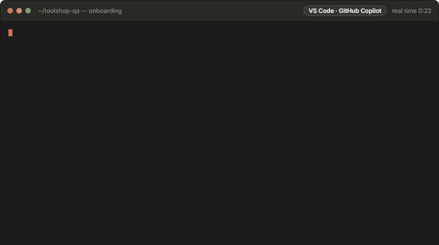
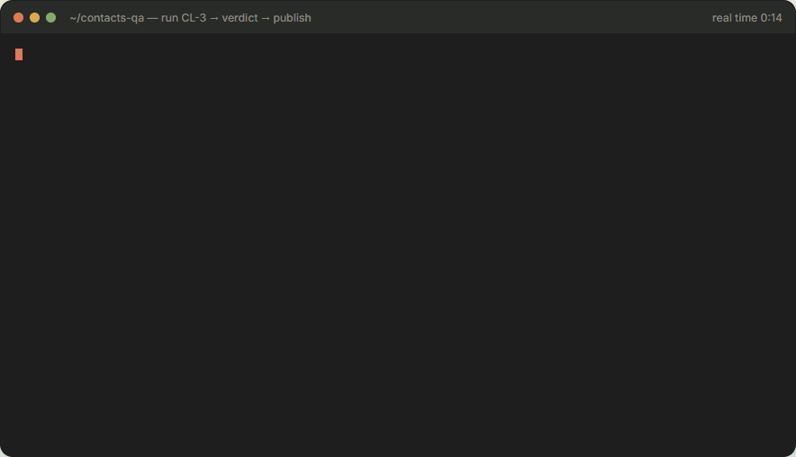

# Held-out Evaluator — an AI agent skill

Works in GitHub Copilot (VS Code agent mode) or Claude Code. The examples say "Opus" for the AI model doing the work.

A project skill ([.github/skills/heldout-evaluator](.github/skills/heldout-evaluator/SKILL.md)) that
evaluates a Jira story against any web application or API using **held-out** Playwright tests,
written from the requirement alone:

```
Jira story + attachments + comments
  → requirement contract: built by a subagent from any story format, every item cited to source lines,
    every line accounted for, every expected value grounded — then checked by an independent reviewer subagent
  → Gherkin scenarios + Playwright UI/API tests (scaffolded from the contract) → freeze → harden vs the live AUT
  → run → triage (script defect vs application defect, reproduced live) → repair & re-run
  → verdict.md (traceability, reproduction steps, evidence) → Jira comment + attachment → you decide
  → app knowledge: what the passing tests proved about driving the app, for the next story (never what it answers)
```

**The Held-out Evaluator guide:** [docs/heldout-evaluator.html](docs/heldout-evaluator.html) explains every capability with diagrams, plain-English
summaries, terminal replays and recordings of the tests driving a real app. Git hosts show HTML as source,
so open it from a clone (or a Pages site) in a browser.

## Adopt it in another project (about 1 minute)

Get the skill once, from its GitLab repository. Then run its `init` from the
root of the project that will hold the evaluations:

```bash
git clone --depth 1 --filter=blob:none --sparse <skill-repository-url> "$HOME/heldout-skill"
git -C "$HOME/heldout-skill" sparse-checkout set .github .claude .vscode .gitlab heldout-support
npx -y tsx "$HOME/heldout-skill/.github/scripts/heldout.ts" init --base-url https://your-app --install
```



The same lines work in bash, zsh and PowerShell. The sparse clone fetches only the skill and the files a project
needs (about 2 MB, a few seconds), not the demo evaluations stored beside it. There are no templates: `init` copies the
files as they are in the skill repository, to the same paths. That is the skill into `.github/skills/heldout-evaluator/`,
its scripts into `.github/scripts/` (next to any scripts of your own there, never over one), the subagents into
`.github/agents/` (with bridges in `.claude/` for Claude Code), and `playwright.config.ts`, `tsconfig.json`, `.mcp.json`,
`.env.example` and `heldout-support/fixtures.ts`. A file your project already has is kept. Then it visits your app once and fills in the profile:
- the profile id, from the host name (from the page title for localhost or an IP address);
- the app's name, from its page title (shown in verdicts);
- the test-id attribute the app renders;
- the API host, when the web app calls an API on another host;
- `blockHosts`, the ad and analytics networks the page loads.

Add `--api-base-url` if the API lives elsewhere, and `--ci gitlab` for a GitLab CI regression pipeline. Then:

1. `npm run heldout -- doctor --learn`. It checks Node, dependencies, the browser, config, reachability, Jira, subagents,
   secrets (including any secret value that has slipped into a file git would commit) and the accounts recipe. Every
   problem comes with the command that fixes it. `--learn` also starts the app knowledge (below).
2. Reload VS Code once (or start a new Claude Code session), so the agent loads the Playwright MCP server and the
   subagents.
3. Ask GitHub Copilot (agent mode) or Claude Code: **"Run a held-out evaluation of ABC-123"**.

**Update:** `git -C "$HOME/heldout-skill" pull`, then run the same `init` line again. It replaces the project's copy of
the skill. It also refreshes every file it copied (configs, fixtures, subagents and bridges) unless you changed it since,
and it never touches your config, `.env` or evaluations. `doctor` shows which version is installed and lists the copied
files you changed, which updates leave as they are.

Or just ask GitHub Copilot or Claude Code to "set up held-out evaluation for https://your-app". The skill asks for anything it can't infer,
then runs the steps above.

## Using it in GitHub Copilot or Claude Code

The skill and its subagents live in `.github/`, where GitHub Copilot reads them. Claude Code reads only `.claude/`,
so `init` adds short bridges there that point at `.github/`. Nothing is kept in two places.

| What | File | GitHub Copilot (VS Code agent mode) | Claude Code |
| --- | --- | --- | --- |
| The skill | `.github/skills/heldout-evaluator/SKILL.md` | ✔ agent skill | via the bridge `.claude/skills/heldout-evaluator/SKILL.md` |
| The phase subagents | `.github/agents/*.agent.md` | ✔ custom agents | via the bridges `.claude/agents/*.md` |
| Model fallbacks | `model:` in each `.agent.md` · `.claude/settings.json` | ✔ the `model:` list, tried in order | ✔ `fallbackModel` (also used by subagents) |
| Copilot reads `.github/` only, not the bridges | `.vscode/settings.json` | ✔ | — |
| Playwright MCP server (browser tier 2) | `.mcp.json` | ✔ (portable `mcpServers` format) | ✔ project MCP server |
| The `heldout` command line | `npm run heldout -- …` | ✔ (plain Node, any terminal) | ✔ (plain Node) |

The main agent orchestrates: it runs the `heldout` commands between phases and hands each phase that needs a model to
its own subagent, in a fresh context. The separation is part of the held-out design: the reviewer never sees the
builder's reasoning, the test author has no browser and never sees the application, and the triager didn't write the
tests it judges.

| Subagent | Phase | Browser | GitHub Copilot (first available) | Claude Code |
| --- | --- | --- | --- | --- |
| `heldout-contract-extractor` | 1b build the requirement contract | — | Claude Opus 5.5 → Claude Opus 5 → Claude Sonnet 5.5 → GPT-6.1 Sol | `opus`, falling back to `sonnet` |
| `heldout-contract-reviewer` | 1b review it independently | — | Claude Sonnet 5.5 → Claude Sonnet 5 → Claude Opus 5.5 → GPT-6.1 Sol | `sonnet`, falling back to `opus` |
| `heldout-scenario-writer` | 2 review + scenarios | — | as the extractor | `opus`, falling back to `sonnet` |
| `heldout-test-author` | 3 draft the tests | — | as the extractor | `opus`, falling back to `sonnet` |
| `heldout-hardener` | 4 harden; repair script defects | ✔ | as the extractor | `opus`, falling back to `sonnet` |
| `heldout-triager` | 6 triage, reproduce live | ✔ | as the extractor | `opus`, falling back to `sonnet` |

To change a model, edit the `model:` list in `.github/agents/*.agent.md` (Copilot) and the `model:` line in
`.claude/agents/*.md` (Claude Code).

In Copilot, pick **Claude Opus** in the model picker and use agent mode; in Claude Code, pick Opus with `/model`. The
agent asks you its questions in the chat, and passes `--quiet` to `heldout run` for the short digest (or set
`HELDOUT_QUIET=1`).

## Point it at your application and Jira

| What | Where |
| --- | --- |
| Applications (UI URL, API URL, test-id attribute (detected by `init`), healthcheck, `blockHosts` for ads/analytics, `overlays` for cookie and welcome dialogs, `maxWorkers` and `minTestIntervalMs` for rate-limited hosts) | [heldout.config.json](heldout.config.json) → `auts` (schema-validated) · `npm run heldout -- add-aut <id> --base-url …` |
| Test accounts, written once per app and used by `seed.account()` / `signIn()` in every story: existing accounts (passwords in `.env`, CI variables or HashiCorp Vault), or accounts the tests create over the API or on the app's sign-up page (deleted afterwards when the app allows it) | `npm run heldout -- accounts --add-existing …` · `auts.<id>.accounts` — [data-and-journeys.md §4a](.github/skills/heldout-evaluator/references/data-and-journeys.md) |
| Secrets | `.env` (git-ignored), real environment variables (CI; they win over `.env`), or Vault: `${env:NAME}` / `${vault:path#field}` wherever a secret is referenced; `VAULT_ADDR` + `vault login` (or `VAULT_TOKEN`, AppRole) |
| Which application a story targets | `npm run heldout -- fetch KEY --aut <id>` (writes `evaluations/KEY/evaluation.json`) |
| Jira | `JIRA_BASE_URL`, `JIRA_EMAIL`, `JIRA_API_TOKEN` in `.env`; `doctor --jira` finds your acceptance-criteria custom field |
| Browser tier 2 (Playwright MCP) | [.mcp.json](.mcp.json) |
| Subagents (contract, scenarios, tests, hardening, triage) | [.github/agents/](.github/agents/) |
| CI regression run | `heldout init --ci gitlab` → a GitLab CI job (`.gitlab/heldout.gitlab-ci.yml`, included from `.gitlab-ci.yml`) |

## Commands

Everything goes through one entry point: `npm run heldout -- <command>`. `npm run heldout -- help` lists the commands.

| Command | Purpose |
| --- | --- |
| `init`, `add-aut`, `doctor`, `status [KEY]` | set up (and update the skill), check the setup, see where each story is and the next step |
| `secret NAME --generate` · `secret NAME --ask` | a test password into `.env` without showing it: generated, or typed at a hidden prompt |
| `accounts --add-existing …` · `accounts --from-chain …` · `accounts --check` | test accounts: existing ones (.env, CI, Vault) or created by the tests; checked live |
| `fetch KEY [--aut id]` | story, attachments and comments; binds the AUT; detects requirement revisions |
| `contract KEY --pack` · `contract KEY` · `contract KEY --review-prompt` | evidence pack; checks for the model-built contract (anchoring, coverage, grounded literals, review) |
| `scaffold KEY` | feature header and test stubs generated from the contract |
| `lint`, `integrity`, `inspect`, `api-probe [--chain]`, `mcp-probe` | traceability, freeze/verify, UI and API probing (tiers 2 and 3) |
| `knowledge KEY` · `knowledge KEY --add …` · `knowledge KEY --harvest --apply` | app knowledge: read after the freeze, record while hardening, keep what passing tests proved |
| `run`, `triage`, `verdict`, `publish`, `scrub` | run → triage → verdict → Jira; remove secrets from artifacts |
| `npm run test:skill` · `npm run typecheck` | the skill's own tests (including a fake Jira) · TypeScript |

## Requirement contract: any story format, evidence not recall

A model reads the story, whatever its shape: AC field or bullets, Given/When/Then, tables, prose, rules in a CSV,
an API spec in an attachment, a mock-up image, clarifications in comments. It writes
`requirement-contract.json`, and everything downstream works from that. Four guards keep it factual:

- Each AC is quoted verbatim from cited lines, and the quote is verified.
- Every source line is accounted for, either captured or dismissed with a reason.
- Every expected status, number, message and path appears in the sources, or in an answered gap.
- A separate reviewer subagent confirms each item. Its review is bound to the contract's hash.

Missing elements become gaps, resolved in this order: the requirement, then the application (only for **how**
to exercise it), then config, then **you**. **What** is correct is never read off the application.
See [requirement-contract.md](.github/skills/heldout-evaluator/references/requirement-contract.md).

## Test types

Every scenario has exactly one test type, a criterion can have any number of scenarios of any type, and every
acceptance criterion is covered with the types its wording calls for. A type the story doesn't state or clearly imply becomes a question, not a guessed test. The verdict shows coverage
and defects per type.

| Type | What it proves |
| --- | --- |
| `functional` | the happy path does what the criterion says |
| `negative` | invalid input and refusals are handled, and nothing is stored |
| `boundary` | values on and just outside each stated limit |
| `security` | authentication, authorisation, one user's data hidden from another |
| `idempotency` | the same request sent again leaves the same result (retries, repeated submits) |
| `concurrency` | simultaneous requests on shared state keep the stated rule (last item in stock, double booking) |
| `audit` | who did what and when is recorded where the app shows it (history page, activity endpoint) |
| `composition` | several steps or criteria chained into one flow, each step feeding the next (create → edit → delete) |
| `integration` | the UI and the API agree |
| `contract` | API shape, fields and status codes |
| `accessibility` | accessible names, labels, keyboard use, WCAG criteria |

Rules for each type: [scenario-format.md](.github/skills/heldout-evaluator/references/scenario-format.md).

## Data seeding, API pre-steps and entry points

Tests create (and clean up) their own data through the AUT's API, run auth, lookup and readiness pre-steps
as validated preconditions, and start where the AC starts. A failed precondition is reported as BLOCKED,
never as the requirement failing. Strategy:
[data-and-journeys.md](.github/skills/heldout-evaluator/references/data-and-journeys.md).

## App knowledge: each story makes the next one faster

The evaluator keeps what it learns about driving each application in `aut-knowledge/<profile>/`: routes and
readiness anchors, proven locators, endpoints with their auth and request fields, seed recipes. `doctor --learn` starts
it; every story adds what its passing tests proved. It opens only after the freeze and never holds what the application
answers, so tests stay held out. Every write is a new file, so teams share it through git without merge conflicts.
See [app-knowledge.md](.github/skills/heldout-evaluator/references/app-knowledge.md) and the
[guide](docs/heldout-evaluator.html#knowledge).

## Demos and evaluator testing



**Sample evaluations, made with the current skill.** Each was run end to end from a fresh onboarding, twice, and matches
the answer key written for it before evaluation. Every one is complete: the story and its evidence pack, the requirement
contract and its independent review, the scenarios, the frozen draft and the hardened tests, the hardening log, the
runs (results, screenshots, API exchanges and live confirmations; the HTML reports and traces stay local), the triage
and the verdict, and the comment and attachment published to Jira.

| Story | AUT | What it shows | Verdict |
| --- | --- | --- | --- |
| [DQ-2](evaluations/DQ-2/verdict.md) | DemoQA | existing test accounts only (passwords in `.env` and in HashiCorp Vault), the user id found in the page's own API call, a reset that keeps shared accounts clean | ✅ PASS |
| [CL-3](evaluations/CL-3/verdict.md) | Contact List | users the tests create and delete, a UI sign-in, a native confirm dialog, a page that loads its record after opening | ✅ PASS |
| [TOOL-4](evaluations/TOOL-4/verdict.md) | Practice Software Testing (Toolshop) | criteria in a Jira custom field, a PO comment that changes a status, an API on its own host, users the app won't let tests delete | ✅ PASS |
| [CL-4](evaluations/CL-4/verdict.md) | Contact List | the FAIL path on security criteria written as Gherkin: tokens, sign-out, two users, and a PATCH that hands a contact to another user | ❌ FAIL (1) |
| [JS-2](evaluations/JS-2/verdict.md) | OWASP Juice Shop (local Docker) | the FAIL path: a too-short password accepted and another customer's basket readable, each reproduced live | ❌ FAIL (2) |
| [JS-3](evaluations/JS-3/verdict.md) | OWASP Juice Shop (throw-away container) | every test type in one story (16 scenarios, several per type): anonymous reviews, editing someone else's review, a forged author and simultaneous likes all counted | ❌ FAIL (4) |

The DQ-2 sample uses a variant of the story in which user creation is switched off (its `requirement/story.md`); the
accounts it used no longer exist, so re-running it needs accounts of your own (`heldout accounts --add-existing`).
Re-running the samples in this repository needs these in `.env`: `APP_PASSWORD_1`, `APP_PASSWORD_2` and `VAULT_ADDR`
(DQ-2), and the password of the accounts the tests create, `CL_USER_PASSWORD` (CL-3, CL-4), `TS_USER_PASSWORD` (TOOL-4)
and `JS_USER_PASSWORD` (JS-2). `heldout doctor` lists any that are missing.

**Stories to try.** [demo/stories/](demo/stories/) holds 23 stories on six public applications (Automation Exercise,
Contact List, DemoQA, OWASP Juice Shop, ParaBank, Toolshop), each with a machine-readable answer key written before any
evaluation ([demo/answer-keys/](demo/answer-keys/)). `npx tsx demo/score.ts` scores the evaluations in `evaluations/`
against them → [demo/SCORECARD.md](demo/SCORECARD.md). How the skill was tested, round by round, and every defect
found in it: the [evaluator test report](demo/EVALUATOR-TEST-REPORT.md). The evaluations of earlier rounds, made by
earlier versions of the skill, are kept in the repository history (tag `blind-round-evaluations`).
