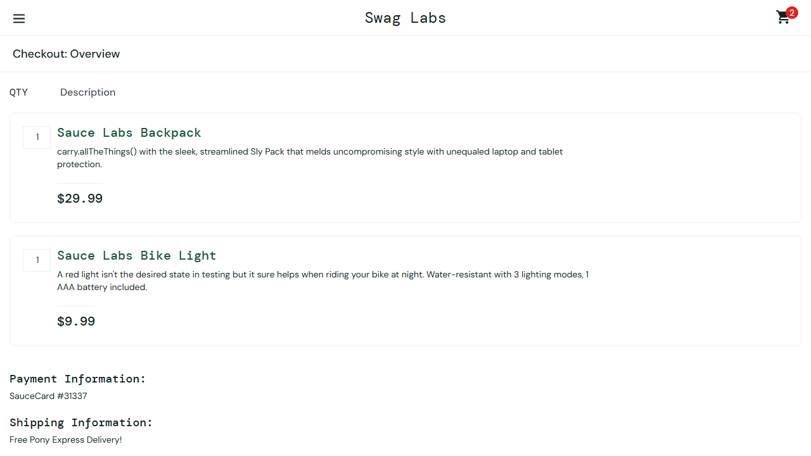
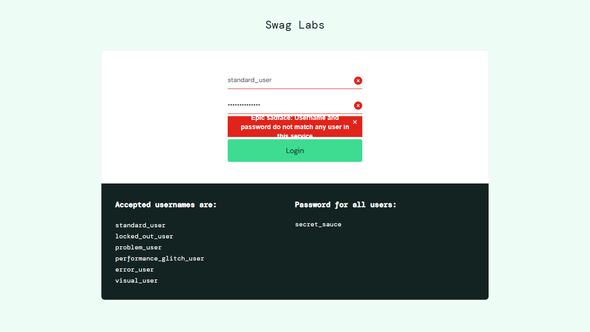

# Held-out Evaluation Verdict — DEMO-101

> **Verdict: ❌ FAIL** — 3 application defect(s) reproduced by the evaluator: the AUT does not satisfy AC-2, AC-3, AC-7. Awaiting reviewer confirmation.

| | |
| --- | --- |
| Story | [DEMO-101](https://your-domain.atlassian.net/browse/DEMO-101) — Shopper can sign in, build a cart and complete checkout |
| Application under test | Swag Labs (saucedemo.com demo shop) (profile `swag-labs`) — UI https://www.saucedemo.com |
| Final run | `04-regression` · 2026-09-26T15:37:05.770Z · 31s |
| Tests | 12 total · 9 passed · 3 failed · 0 flaky · 0 skipped (from 12 scenarios) |
| Held-out integrity | ✅ PRESERVED — 24 requirement assertions identical to the pre-hardening draft |
| Hardening | Tier 3 (bundled inspector `inspect.ts` + `--capture` run). Tier 1 (IDE browser tool) and tier 2 (Playwright MCP) were not loaded in this session; `.mcp.json` now registers Playwright MCP for later sessions. |
| Evaluator | Claude Code — heldout-evaluator skill |
| Generated | 2026-09-26T15:38:14.331Z |

> This verdict is the evaluator's **recommendation**. Each finding below has requirement traceability, reproduction steps and evidence, so a reviewer can confirm or reject it. Nothing has been raised in Jira; the only Jira activity is this report and a summary comment on the story.

## Findings summary

| ID | Suggested severity | Criteria | Test type | Finding | Tests | Reviewer decision |
| --- | --- | --- | --- | --- | --- | --- |
| APP-1 | Critical | AC-7 | functional | Sales tax charged at 8% instead of the 10% in pricing-rules.md | SCN-010 | ☐ confirm · ☐ reject · ☐ clarify |
| APP-2 | Major | AC-3 | negative | Credential fields are not cleared after a failed sign-in | SCN-004 | ☐ confirm · ☐ reject · ☐ clarify |
| APP-3 | Minor | AC-2 | negative | Locked-account error message does not match the required wording | SCN-002 | ☐ confirm · ☐ reject · ☐ clarify |

## Findings: suspected application defects (3 root cause(s), 3 failing test(s))

### APP-1 · SCN-010 · AC-7 — Sales tax charged at 8% instead of the 10% in pricing-rules.md

| | |
| --- | --- |
| Suggested severity | Critical |
| Requirement AC-7 | The checkout overview shows the Item total, Tax and Total. Item total is the sum of the prices of the items in the cart; Tax is calculated according to the attached pricing-rules.md; Total = Item total + Tax. |
| Requirement source | story AC-7, pricing-rules.md §Item total, §Tax, §Total |
| Test type · layer | functional · ui |
| SCN-010: expected (requirement) → actual (AUT) | `4` → `3.2` |
| Failing step | And the Tax equals 10% of the Item total rounded half-up to 2 decimals |
| Evaluator classification | APPLICATION_DEFECT (reproduced live) |

#### How to reproduce

**Manually (scenario steps):**

1. Given I am on the sign-in page
2. Given I am signed in as the "standard" shopper
3. And I have added the 1st and 2nd listed products to the cart, noting their prices
4. When I open the cart and proceed to checkout
5. And I continue with my First Name, Last Name and Postal Code
6. Then the Item total equals the sum of the noted prices
7. And the Tax equals 10% of the Item total rounded half-up to 2 decimals
8. And the Total equals the Item total plus the Tax

**Automated re-run of the failing test(s):**

```bash
npx tsx .claude/skills/heldout-evaluator/scripts/run.ts DEMO-101 --label repro --grep "SCN-010:"
```

#### Evidence



- [Page/test context at failure](runs/04-regression/artifacts/DEMO-101-tests-demo-101-DE-bc3c3-ls-follow-the-pricing-rules-chromium-retry1/error-context.md)
- Step-by-step trace: `npx playwright show-trace evaluations/DEMO-101/runs/04-regression/artifacts/DEMO-101-tests-demo-101-DE-bc3c3-ls-follow-the-pricing-rules-chromium-retry1/trace.zip`
- Live re-check by the evaluator: Reproduced live on 2026-09-26 (tier 3) with the first two catalogue products: 'Item total: $39.98', 'Tax: $3.20', 'Total: $43.18' — see runs/02-eval/confirm/SCN-010.png

**Evaluator's analysis:** Item total ($39.98 = $29.99 + $9.99) and Total = Item total + Tax both hold, isolating the fault to the tax rate: $3.20 is 8.0% of $39.98, while pricing-rules.md (attached to the story, owned by Finance) requires 10% → $4.00. Money is computed wrongly on every order. (Confirmed in run 03-rerun; identical failure signature in 04-regression.)

**Reviewer decision:** ☐ Confirm as defect · ☐ Not a defect (explain) · ☐ Requirement needs clarification

### APP-2 · SCN-004 · AC-3 — Credential fields are not cleared after a failed sign-in

| | |
| --- | --- |
| Suggested severity | Major |
| Requirement AC-3 | When the password is wrong, the error "Epic sadface: Username and password do not match any user in this service" is shown and, for security, both the Username and Password fields are cleared. |
| Requirement source | story AC-3 |
| Test type · layer | negative · ui |
| SCN-004: expected (requirement) → actual (AUT) | `""` → `"standard_user"` |
| SCN-004: also failed | [REQ AC-3] Password field cleared — `""` → `"wrong_password"` |
| Failing step | Then the Username field is empty |
| Evaluator classification | APPLICATION_DEFECT (reproduced live) |

#### How to reproduce

**Manually (scenario steps):**

1. Given I am on the sign-in page
2. When I sign in as the "standard" shopper with the password "wrong_password"
3. Then the Username field is empty
4. And the Password field is empty

**Automated re-run of the failing test(s):**

```bash
npx tsx .claude/skills/heldout-evaluator/scripts/run.ts DEMO-101 --label repro --grep "SCN-004:"
```

#### Evidence



- [Page/test context at failure](runs/04-regression/artifacts/DEMO-101-tests-demo-101-DE-ff7bc-dential-fields-for-security-chromium-retry1/error-context.md)
- Step-by-step trace: `npx playwright show-trace evaluations/DEMO-101/runs/04-regression/artifacts/DEMO-101-tests-demo-101-DE-ff7bc-dential-fields-for-security-chromium-retry1/trace.zip`
- Live re-check by the evaluator: Reproduced live on 2026-09-26 (tier 3): after the error, Username='standard_user' and Password='wrong_password' remain — see runs/02-eval/confirm/SCN-004.png

**Evaluator's analysis:** Both textboxes are located; after the wrong-password error is displayed they still contain the typed username and password. AC-3 requires both to be cleared for security. The error message part of AC-3 passes (SCN-003), so the fault is isolated to field clearing. (Confirmed in run 03-rerun; identical failure signature in 04-regression.)

**Reviewer decision:** ☐ Confirm as defect · ☐ Not a defect (explain) · ☐ Requirement needs clarification

### APP-3 · SCN-002 · AC-2 — Locked-account error message does not match the required wording

| | |
| --- | --- |
| Suggested severity | Minor |
| Requirement AC-2 | A shopper whose account is locked cannot sign in. The error message "Your account has been locked. Please contact customer support." is shown and the shopper stays on the sign-in page. |
| Requirement source | story AC-2, test-users.csv (locked) |
| Test type · layer | negative · ui |
| SCN-002: expected (requirement) → actual (AUT) | `"Your account has been locked. Please contact customer support."` → `"Epic sadface: Sorry, this user has been locked out."` |
| Failing step | Then I see the error "Your account has been locked. Please contact customer support." |
| Evaluator classification | APPLICATION_DEFECT (reproduced live) |

#### How to reproduce

**Manually (scenario steps):**

1. Given I am on the sign-in page
2. When I sign in as the "locked" shopper
3. Then I see the error "Your account has been locked. Please contact customer support."
4. And I am still on the sign-in page

**Automated re-run of the failing test(s):**

```bash
npx tsx .claude/skills/heldout-evaluator/scripts/run.ts DEMO-101 --label repro --grep "SCN-002:"
```

#### Evidence


- [Page/test context at failure](runs/04-regression/artifacts/DEMO-101-tests-demo-101-DE-d0deb--told-the-account-is-locked-chromium-retry1/error-context.md)
- Step-by-step trace: `npx playwright show-trace evaluations/DEMO-101/runs/04-regression/artifacts/DEMO-101-tests-demo-101-DE-d0deb--told-the-account-is-locked-chromium-retry1/trace.zip`
- Live re-check by the evaluator: Reproduced live on 2026-09-26 (tier 3): signing in as locked_out_user shows the alert 'Epic sadface: Sorry, this user has been locked out.' — see runs/02-eval/confirm/SCN-002.png

**Evaluator's analysis:** The alert is located and visible, the shopper correctly stays on the sign-in page (that part of AC-2 passes), but the message text differs from the verbatim wording AC-2 mandates. Behaviour (blocking the locked account) is correct; the communicated message is not. (Confirmed in run 03-rerun; identical failure signature in 04-regression.)

**Reviewer decision:** ☐ Confirm as defect · ☐ Not a defect (explain) · ☐ Requirement needs clarification

## Script defects found and repaired (1)

| Found in run | Test | Symptom | Diagnosis | Fix applied | Final run |
| --- | --- | --- | --- | --- | --- |
| `02-eval` | SCN-011 | TimeoutError: locator.click: Timeout 10000ms exceeded. | On the cart page the Checkout control exists and works, but it is a button; the spec located it as a link (0 matches). Every other checkout scenario (SCN-008/009/010) passes the same step with the button locator, so the AUT is fine. | Restored the verified locator getByRole('button', { name: 'Checkout' }) via the shared openCartAndCheckout() helper; probe count=1; integrity re-checked (PRESERVED). | ✅ passed |

## Test results

| Test | Title | Criteria | Type | Result | Classification |
| --- | --- | --- | --- | --- | --- |
| SCN-001 | Standard shopper signs in and sees the full catalogue | AC-1 | functional | ✅ passed | - |
| SCN-002 | Locked shopper cannot sign in and is told the account is locked | AC-2 | negative | ❌ failed | APPLICATION_DEFECT · APP-3 |
| SCN-003 | Wrong password shows the credentials error | AC-3 | negative | ✅ passed | - |
| SCN-004 | Wrong password clears the credential fields for security | AC-3 | negative | ❌ failed | APPLICATION_DEFECT · APP-2 |
| SCN-005 | Sorting by price low to high orders products by ascending price | AC-4 | functional | ✅ passed | - |
| SCN-006 | Adding products increases the cart badge by one each time | AC-5 | functional | ✅ passed | - |
| SCN-007 | Removing products decreases the cart badge and hides it when empty | AC-5 | functional | ✅ passed | - |
| SCN-008 | Checkout requires a First Name | AC-6 | negative | ✅ passed | - |
| SCN-009 | Checkout requires a Last Name and a Postal Code | AC-6 | negative | ✅ passed | - |
| SCN-010 | Checkout overview totals follow the pricing rules | AC-7 | functional | ❌ failed | APPLICATION_DEFECT · APP-1 |
| SCN-011 | Finishing the order confirms it and empties the cart | AC-8 | functional | ✅ passed | - |
| SCN-012 | Logging out returns to sign-in and protects the Products page | AC-9 | functional | ✅ passed | - |

## Requirement coverage

| Criterion | Requirement | Tests | Result |
| --- | --- | --- | --- |
| AC-1 | A registered shopper who signs in with valid credentials lands on the "Products" page, which lists the full catalogue of 6 products. | SCN-001 | ✅ met |
| AC-2 | A shopper whose account is locked cannot sign in. The error message "Your account has been locked. Please contact customer support." is shown and the shopper stays on the sign-in page. | SCN-002 | ❌ not met |
| AC-3 | When the password is wrong, the error "Epic sadface: Username and password do not match any user in this service" is shown and, for security, both the Username and Password fields are cleared. | SCN-003, SCN-004 | ❌ not met |
| AC-4 | The shopper can sort products by "Price (low to high)"; products are then displayed in ascending order of price. | SCN-005 | ✅ met |
| AC-5 | Adding a product to the cart increases the cart badge count by one; removing it decreases the count, and the badge is not shown when the cart is empty. | SCN-006, SCN-007 | ✅ met |
| AC-6 | At checkout, First Name, Last Name and Postal Code are mandatory. Continuing without a First Name shows "Error: First Name is required". | SCN-008, SCN-009 | ✅ met |
| AC-7 | The checkout overview shows the Item total, Tax and Total. Item total is the sum of the prices of the items in the cart; Tax is calculated according to the attached pricing-rules.md; Total = Item total + Tax. | SCN-010 | ❌ not met |
| AC-8 | Finishing the order shows the confirmation "Thank you for your order!" and the cart is empty afterwards. | SCN-011 | ✅ met |
| AC-9 | Logging out returns the shopper to the sign-in page, and protected pages (e.g. the Products page URL) can no longer be opened without signing in again. | SCN-012 | ✅ met |

## Traceability matrix

Each row links an acceptance criterion to the requirement source it came from, the scenario that proves it, that scenario's test type and layer, the executed tests, the result and any defect. Every test carries `@AC-n` and `@type:<t>` tags (enforced by the preflight lint).

| Criterion | Source | Scenario | Type | Layer | Tests passed | Result | Defects |
| --- | --- | --- | --- | --- | --- | --- | --- |
| **AC-1** | story AC-1, test-users.csv (standard) | SCN-001 Standard shopper signs in and sees the full catalogue | functional | ui | 1/1 | ✅ meets requirement | - |
| **AC-2** | story AC-2, test-users.csv (locked) | SCN-002 Locked shopper cannot sign in and is told the account is locked | negative | ui | 0/1 | ❌ fails requirement | APP-3 |
| **AC-3** | story AC-3, test-users.csv (standard) | SCN-003 Wrong password shows the credentials error | negative | ui | 1/1 | ✅ meets requirement | - |
| ↳ | story AC-3 | SCN-004 Wrong password clears the credential fields for security | negative | ui | 0/1 | ❌ fails requirement | APP-2 |
| **AC-4** | story AC-4 | SCN-005 Sorting by price low to high orders products by ascending price | functional | ui | 1/1 | ✅ meets requirement | - |
| **AC-5** | story AC-5 | SCN-006 Adding products increases the cart badge by one each time | functional | ui | 1/1 | ✅ meets requirement | - |
| ↳ | story AC-5 | SCN-007 Removing products decreases the cart badge and hides it when empty | functional | ui | 1/1 | ✅ meets requirement | - |
| **AC-6** | story AC-6 | SCN-008 Checkout requires a First Name | negative | ui | 1/1 | ✅ meets requirement | - |
| ↳ | story AC-6 | SCN-009 Checkout requires a Last Name and a Postal Code | negative | ui | 1/1 | ✅ meets requirement | - |
| **AC-7** | story AC-7, pricing-rules.md §Item total, §Tax, §Total | SCN-010 Checkout overview totals follow the pricing rules | functional | ui | 0/1 | ❌ fails requirement | APP-1 |
| **AC-8** | story AC-8 | SCN-011 Finishing the order confirms it and empties the cart | functional | ui | 1/1 | ✅ meets requirement | - |
| **AC-9** | story AC-9 | SCN-012 Logging out returns to sign-in and protects the Products page | functional | ui | 1/1 | ✅ meets requirement | - |

## Coverage by test type

| Test type | Scenarios | Tests | Passed | Failed | Flaky | Defects |
| --- | --- | --- | --- | --- | --- | --- |
| functional | 7 | 7 | 6 | 1 | 0 | APP-1 |
| negative | 5 | 5 | 3 | 2 | 0 | APP-2, APP-3 |

## Requirement gaps, assumptions and open questions

**Assumptions the evaluation made:**

- The story names no specific products; cart scenarios use the first products listed in the catalogue.
- Checkout personal details are not specified; neutral values from test-data.json are used.
- AC-6 gives an exact message only for a missing First Name; for Last Name / Postal Code we only
- "cart is empty" (AC-8) is observed through the cart badge not being shown (AC-5 defines that signal).

## How this verdict was produced

1. The requirement and its attachments were fetched from Jira and reviewed ([requirement-review.md](requirement-review.md) when present), then converted into Gherkin scenarios (`scenarios.feature`). Each scenario is tagged with the acceptance criteria it proves, and API endpoints are declared.
2. Playwright TypeScript tests (UI and API) were written from the scenarios **only**, with no access to the AUT source or developer tests. Expected values were copied verbatim from the requirement.
3. The draft was frozen, then hardened against the live AUT: locators, waits, navigation and API plumbing only. Expected outcomes were never aligned with AUT behaviour (integrity check above).
4. Preflight gates (traceability lint and an AUT healthcheck) passed before the run. Every failure was triaged automatically, then re-investigated live before being classified as an application defect.
5. Script defects were repaired (mechanics only) and the full suite re-run. This verdict reflects the final run.

| Run | Passed | Failed | Flaky |
| --- | --- | --- | --- |
| `01-harden` (hardening dry-run) | 9 | 3 | 0 |
| `02-eval` | 8 | 4 | 0 |
| `03-rerun` | 9 | 3 | 0 |
| `04-regression` (final) | 9 | 3 | 0 |

## Artifacts

- Requirement: [requirement/story.md](requirement/story.md)
- Scenarios: [scenarios.feature](scenarios.feature)
- Tests: [tests/](tests/) · frozen draft: [draft/](draft/)
- Hardening log: [hardening/hardening-log.md](hardening/hardening-log.md)
- Triage: [runs/04-regression/triage.md](runs/04-regression/triage.md) · JUnit: runs/04-regression/junit.xml
- HTML report: `npx playwright show-report evaluations/DEMO-101/runs/04-regression/html`
