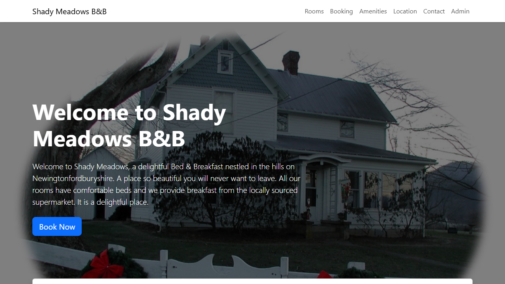

# Held-out Evaluation Verdict — DEMO-202

> **Verdict: ❌ FAIL** — 9 application defect(s) reproduced by the evaluator: the AUT does not satisfy AC-1, AC-4, AC-5, AC-6, AC-7, AC-8, AC-12, AC-14, AC-16. Awaiting reviewer confirmation.

| | |
| --- | --- |
| Story | [DEMO-202](https://your-domain.atlassian.net/browse/DEMO-202) — Guest enquiries — contact form, rooms catalogue and messages API |
| Application under test | Shady Meadows B&B (Restful Booker Platform demo) (profile `shady-meadows`) — UI https://automationintesting.online |
| Final run | `07-presteps` · 2026-09-26T17:56:46.073Z · 82s |
| Tests | 41 total · 30 passed · 11 failed · 0 flaky · 0 skipped (from 22 scenarios) |
| Held-out integrity | ✅ PRESERVED WITH 1 AUDITED AMENDMENT(S) — 43 requirement assertions; see "Assertion amendments" |
| Hardening | Tier 2 cross-check (Playwright MCP driven through the bundled stdio client `mcp-probe.ts`; walks in `hardening/tier2/`) + Tier 3 (bundled inspector `inspect.ts` for UI, `api-probe.ts` for API, `run.ts --capture` dry-run). Tier 1 (IDE browser) was not available, and the Playwright MCP tools were not loaded natively in the session (pending approval), so the real Playwright MCP server was driven over stdio instead. |
| Evaluator | Claude Code — heldout-evaluator skill |
| Generated | 2026-09-26T19:20:40.901Z |

> This verdict is the evaluator's **recommendation**. Each finding below has requirement traceability, reproduction steps and evidence, so a reviewer can confirm or reject it. Nothing has been raised in Jira; the only Jira activity is this report and a summary comment on the story.

## Findings summary

| ID | Suggested severity | Criteria | Test type | Finding | Tests | Reviewer decision |
| --- | --- | --- | --- | --- | --- | --- |
| APP-1 | Critical | AC-8 | security | Messages API exposes guest enquiries without authentication | SCN-009, SCN-010 | ☐ confirm · ☐ reject · ☐ clarify |
| APP-2 | Major | AC-1 | accessibility | Message field label is not associated with its textarea | SCN-001 | ☐ confirm · ☐ reject · ☐ clarify |
| APP-3 | Major | AC-4, AC-6 | boundary | Name length rule (2–50 characters) is not enforced | SCN-006.1, SCN-006.4 | ☐ confirm · ☐ reject · ☐ clarify |
| APP-4 | Major | AC-7 | negative | Malformed JSON returns 500 instead of 400 | SCN-008 | ☐ confirm · ☐ reject · ☐ clarify |
| APP-5 | Major | AC-12 | negative | Unknown room id returns 500 instead of 404 | SCN-017 | ☐ confirm · ☐ reject · ☐ clarify |
| APP-6 | Major | AC-14 | accessibility | Every room image has the alt text 'Single Room' | SCN-019 | ☐ confirm · ☐ reject · ☐ clarify |
| APP-7 | Major | AC-16 | idempotency | Idempotency-Key is ignored: a retried enquiry is stored twice | SCN-021 | ☐ confirm · ☐ reject · ☐ clarify |
| APP-8 | Minor | AC-5 | functional | Create enquiry returns 200 OK instead of 201 Created | SCN-005 | ☐ confirm · ☐ reject · ☐ clarify |
| APP-9 | Minor | AC-4, AC-6 | boundary | E-mail without a top-level domain is accepted | SCN-006.17 | ☐ confirm · ☐ reject · ☐ clarify |

## Findings: suspected application defects (9 root cause(s), 11 failing test(s))

### APP-1 · SCN-009, SCN-010 · AC-8 — Messages API exposes guest enquiries without authentication

| | |
| --- | --- |
| Suggested severity | Critical |
| Requirement AC-8 | GET /api/message (list) and GET /api/message/{id} (detail) contain guests' personal data and require a valid staff token. Without a token they respond 401 Unauthorized and return no message data. With a valid token (cookie token, obtained from POST /api/auth/login) the list responds 200 with {"messages": [{"id", "name", "subject", "read"}]}. |
| Requirement source | story AC-8, api-contract.md §GET /api/message |
| Test type · layer | security · api |
| SCN-009: expected (requirement) → actual (AUT) | `401` → `200` |
| SCN-010: expected (requirement) → actual (AUT) | `401` → `200` |
| SCN-009: also failed | [REQ AC-8] no message data without token — `not "\"messages\""` → `"{\"messages\":[{\"id\":1,\"name\":\"James Dean\",\"read\":false,\"subject\":\"Booking enquiry\"},{\"id\":2,\"name\":\"ttt ttt\",\"read\":false,\"subject\":\"Yo…` |
| SCN-010: also failed | [REQ AC-8] no personal data without token — `[Array []]` → `["email", "phone", "description"]` |
| Failing step | Then the response status is 401 |
| Evaluator classification | APPLICATION_DEFECT (reproduced live) |

#### How to reproduce

**Manually (scenario steps):**

1. When I GET /api/message without a token
2. Then the response status is 401
3. And the response contains no message data

**Via the API: SCN-009** (the exact requests the test sent, in order; secrets replaced by placeholders). Request 1 (⟵) is the one that contradicts the requirement:

1. `GET /api/message → 200` ⟵

   ```bash
   curl -i -X GET 'https://automationintesting.online/api/message'
   ```

Observed response of request 1 (SCN-009):

```json
{"messages":[{"id":1,"name":"James Dean","read":false,"subject":"Booking enquiry"},{"id":2,"name":"ttt ttt","read":false,"subject":"You have a new booking!"}]}
```

**API pre-steps: SCN-010** (preconditions the test established through the API; run these first, then substitute the ids and tokens they return):

P1. `POST /api/auth/login → 200`

   ```bash
   curl -i -X POST 'https://automationintesting.online/api/auth/login' \
     -H 'Content-Type: application/json' \
     --data '{"username":"admin","password":"<secret from test-data.json / .env>"}'
   ```

P2. `POST /api/message → 200`

   ```bash
   curl -i -X POST 'https://automationintesting.online/api/message' \
     -H 'Content-Type: application/json' \
     --data '{"name":"QA Guest iozue60u-1","email":"qa.guest@example.com","phone":"01234567890","subject":"QA Subject iozue6le-2","description":"QA held-out evaluation enquiry — please ignore this message."}'
   ```

P3. `GET /api/message → 200`

   ```bash
   curl -i -X GET 'https://automationintesting.online/api/message' \
     -H 'Cookie: <session cookie, e.g. the token returned by the login call>'
   ```

**Via the API: SCN-010** (the exact requests the test sent, in order; secrets replaced by placeholders). Request 1 (⟵) is the one that contradicts the requirement:

1. `GET /api/message/22 → 200` ⟵

   ```bash
   curl -i -X GET 'https://automationintesting.online/api/message/22'
   ```

Observed response of request 1 (SCN-010):

```json
{"description":"QA held-out evaluation enquiry — please ignore this message.","email":"qa.guest@example.com","messageid":22,"name":"QA Guest iozue60u-1","phone":"01234567890","subject":"QA Subject iozue6le-2"}
```

**Automated re-run of the failing test(s):**

```bash
npx tsx .claude/skills/heldout-evaluator/scripts/run.ts DEMO-202 --label repro --grep "SCN-009:"
npx tsx .claude/skills/heldout-evaluator/scripts/run.ts DEMO-202 --label repro --grep "SCN-010:"
```

#### Evidence

- [Page/test context at failure](../../runs/07-presteps/artifacts/DEMO-202-tests-demo-202-DE-d0702-ut-a-staff-token-is-refused-chromium-retry1/error-context.md)
- Step-by-step trace: `npx playwright show-trace evaluations/DEMO-202/runs/07-presteps/artifacts/DEMO-202-tests-demo-202-DE-d0702-ut-a-staff-token-is-refused-chromium-retry1/trace.zip`
- Live re-check by the evaluator: Replayed live on 2026-09-26 (tier 3) without any cookie: GET /api/message → 200 with messages; GET /api/message/1 → 200 with email/phone/description (confirm/SCN-009.md, SCN-010.md)

**Evaluator's analysis:** AC-8: list and detail require a staff token and must return 401 without it. Both return 200 with data to anonymous callers; the detail includes guest e-mail, phone and message text (personal data). Security/privacy defect: the token is not checked on these endpoints. (Confirmed in run 06-seeded; identical failure signature in 07-presteps.)

**Reviewer decision:** ☐ Confirm as defect · ☐ Not a defect (explain) · ☐ Requirement needs clarification

### APP-2 · SCN-001 · AC-1 — Message field label is not associated with its textarea

| | |
| --- | --- |
| Suggested severity | Major |
| Requirement AC-1 | The home page contains a "Send Us a Message" form with the fields Name, Email, Phone, Subject and Message and a "Submit" button. Every field has a programmatically associated label that screen readers announce (WCAG 2.2 SC 1.3.1 / 4.1.2). |
| Requirement source | story AC-1, ux-copy.md §Contact form |
| Test type · layer | accessibility · ui |
| SCN-001: expected (requirement) → actual (AUT) | `visible` → `element not found: getByRole('textbox', { name: 'Message', exact: true })` |
| Failing step | And the fields Name, Email, Phone, Subject and Message are each exposed with that accessible name |
| Evaluator classification | APPLICATION_DEFECT (reproduced live) |

#### How to reproduce

**Manually (scenario steps):**

1. Given I am on the home page
2. Then I see the "Send Us a Message" form
3. And the fields Name, Email, Phone, Subject and Message are each exposed with that accessible name
4. And I see a "Submit" button

**Automated re-run of the failing test(s):**

```bash
npx tsx .claude/skills/heldout-evaluator/scripts/run.ts DEMO-202 --label repro --grep "SCN-001:"
```

#### Evidence



- [Page/test context at failure](../../runs/07-presteps/artifacts/DEMO-202-tests-demo-202-DE-1f36a-ld-with-an-accessible-label-chromium-retry1/error-context.md)
- Step-by-step trace: `npx playwright show-trace evaluations/DEMO-202/runs/07-presteps/artifacts/DEMO-202-tests-demo-202-DE-1f36a-ld-with-an-accessible-label-chromium-retry1/trace.zip`
- Live re-check by the evaluator: Live on 2026-09-26 (tier 3): getByRole('textbox', {name:'Message'}) → 0; label[for=message] exists, textarea#description has no aria-label/aria-labelledby (runs/03-eval/confirm/UI-SCN-001-019.md) · Tier-2 cross-check (Playwright MCP, 2026-09-26): on a ready page Name/Email/Phone/Subject are exposed as textboxes, Message is not (hardening/tier2/a11y-confirm.md).

**Evaluator's analysis:** The strict AC-1 assertion requires every field to be exposed with its accessible name. Name/Email/Phone/Subject pass; Message has no accessible name. Root cause found live: <label for="message"> points to a non-existent id, while the textarea's id is "description", so screen readers announce an unlabeled edit field (WCAG 1.3.1/4.1.2). Automatic triage correctly flagged a strict-assertion failure. (Confirmed in run 06-seeded; identical failure signature in 07-presteps.)

**Reviewer decision:** ☐ Confirm as defect · ☐ Not a defect (explain) · ☐ Requirement needs clarification

### APP-3 · SCN-006.1, SCN-006.4 · AC-4, AC-6 — Name length rule (2–50 characters) is not enforced

| | |
| --- | --- |
| Suggested severity | Major |
| Requirement AC-4 | Field rules and boundaries are defined in the attached field-rules.csv. The UI and the API enforce the same rules. A value exactly on a boundary is valid; one character outside it is invalid. |
| Requirement AC-6 | POST /api/message with one or more invalid fields responds 400 Bad Request. The body is a JSON array of human-readable error strings containing, for each violated length rule, the exact message from field-rules.csv. The enquiry is not stored. |
| Requirement source | story AC-4 / AC-6, field-rules.csv (full boundary matrix) |
| Test type · layer | boundary · api |
| SCN-006.1: expected (requirement) → actual (AUT) | `400` → `200` |
| SCN-006.4: expected (requirement) → actual (AUT) | `400` → `200` |
| Failing step | Then the enquiry is rejected |
| Evaluator classification | APPLICATION_DEFECT (reproduced live) |

#### How to reproduce

**Preconditions the test seeded** (tag `hxozdf050`; recreate equivalent data before reproducing):

- enquiry (created by the scenario): `QA Subject iozdf1dn-2` · cleanup: done

**Manually (scenario steps):**

1. When I POST a valid enquiry to /api/message whose <field> is <value>
2. Then the enquiry is <outcome>
3. And when rejected, the error list contains "<message>"

**Via the API: SCN-006.1** (the exact requests the test sent, in order; secrets replaced by placeholders). Request 1 (⟵) is the one that contradicts the requirement:

1. `POST /api/message → 200` ⟵

   ```bash
   curl -i -X POST 'https://automationintesting.online/api/message' \
     -H 'Content-Type: application/json' \
     --data '{"name":"q","email":"qa.guest@example.com","phone":"01234567890","subject":"QA Subject iozdf1dn-2","description":"QA held-out evaluation enquiry — please ignore this message."}'
   ```

Observed response of request 1 (SCN-006.1):

```json
{"success":true}
```

**Via the API: SCN-006.4** (the exact requests the test sent, in order; secrets replaced by placeholders). Request 1 (⟵) is the one that contradicts the requirement:

1. `POST /api/message → 200` ⟵

   ```bash
   curl -i -X POST 'https://automationintesting.online/api/message' \
     -H 'Content-Type: application/json' \
     --data '{"name":"qqqqqqqqqqqqqqqqqqqqqqqqqqqqqqqqqqqqqqqqqqqqqqqqqqq","email":"qa.guest@example.com","phone":"01234567890","subject":"QA Subject iozhxoca-2","description":"QA held-out evaluation enquiry — please ignore this message."}'
   ```

Observed response of request 1 (SCN-006.4):

```json
{"success":true}
```

**Automated re-run of the failing test(s):**

```bash
npx tsx .claude/skills/heldout-evaluator/scripts/run.ts DEMO-202 --label repro --grep "SCN-006\.1:"
npx tsx .claude/skills/heldout-evaluator/scripts/run.ts DEMO-202 --label repro --grep "SCN-006\.4:"
```

#### Evidence

- [Page/test context at failure](../../runs/07-presteps/artifacts/DEMO-202-tests-demo-202-DE-0cff5-me-1-characters-→-rejected--chromium-retry1/error-context.md)
- Step-by-step trace: `npx playwright show-trace evaluations/DEMO-202/runs/07-presteps/artifacts/DEMO-202-tests-demo-202-DE-0cff5-me-1-characters-→-rejected--chromium-retry1/trace.zip`
- Live re-check by the evaluator: Replayed live on 2026-09-26 (tier 3): name 'Q' → 200, 51×'q' → 200 (confirm/SCN-006.1.md, SCN-006.4.md)

**Evaluator's analysis:** field-rules.csv requires Name 2–50 characters with the error 'Name must be between 2 and 50 characters.'. The API accepts 1- and 51-character names (200). Both boundary rows fail for the same missing rule; the 2 and 50 rows pass. (Confirmed in run 06-seeded; identical failure signature in 07-presteps.)

**Reviewer decision:** ☐ Confirm as defect · ☐ Not a defect (explain) · ☐ Requirement needs clarification

### APP-4 · SCN-008 · AC-7 — Malformed JSON returns 500 instead of 400

| | |
| --- | --- |
| Suggested severity | Major |
| Requirement AC-7 | A request body that is not valid JSON is a client error. POST /api/message responds 400 Bad Request, never a 5xx. |
| Requirement source | story AC-7, api-contract.md §POST /api/message |
| Test type · layer | negative · api |
| SCN-008: expected (requirement) → actual (AUT) | `400` → `500` |
| Failing step | Then the response status is 400 |
| Evaluator classification | APPLICATION_DEFECT (reproduced live) |

#### How to reproduce

**Manually (scenario steps):**

1. When I POST a body that is not valid JSON to /api/message
2. Then the response status is 400

**Via the API: SCN-008** (the exact requests the test sent, in order; secrets replaced by placeholders). Request 1 (⟵) is the one that contradicts the requirement:

1. `POST /api/message → 500` ⟵

   ```bash
   curl -i -X POST 'https://automationintesting.online/api/message' \
     -H 'Content-Type: application/json' \
     --data '{"name": "QA malformed", "email": '
   ```

Observed response of request 1 (SCN-008):

```json
{"error":"Failed to create message"}
```

**Automated re-run of the failing test(s):**

```bash
npx tsx .claude/skills/heldout-evaluator/scripts/run.ts DEMO-202 --label repro --grep "SCN-008:"
```

#### Evidence

- [Page/test context at failure](../../runs/07-presteps/artifacts/DEMO-202-tests-demo-202-DE-98962-JSON-body-is-a-client-error-chromium-retry1/error-context.md)
- Step-by-step trace: `npx playwright show-trace evaluations/DEMO-202/runs/07-presteps/artifacts/DEMO-202-tests-demo-202-DE-98962-JSON-body-is-a-client-error-chromium-retry1/trace.zip`
- Live re-check by the evaluator: Replayed live on 2026-09-26 (tier 3): POST /api/message with a truncated JSON body → 500 (confirm/SCN-008.md)

**Evaluator's analysis:** AC-7: a non-JSON body is a client error and must be 400, never 5xx. The API answers 500 {"error":"Failed to create message"}: server-side failure on client input, which also pollutes error monitoring. (Confirmed in run 06-seeded; identical failure signature in 07-presteps.)

**Reviewer decision:** ☐ Confirm as defect · ☐ Not a defect (explain) · ☐ Requirement needs clarification

### APP-5 · SCN-017 · AC-12 — Unknown room id returns 500 instead of 404

| | |
| --- | --- |
| Suggested severity | Major |
| Requirement AC-12 | GET /api/room/{id} responds 200 with a single Room for an existing id, and 404 Not Found for an id that does not exist. |
| Requirement source | story AC-12, api-contract.md §GET /api/room/{id} |
| Test type · layer | negative · api |
| SCN-017: expected (requirement) → actual (AUT) | `404` → `500` |
| Failing step | Then the response status is 404 |
| Evaluator classification | APPLICATION_DEFECT (reproduced live) |

#### How to reproduce

**Manually (scenario steps):**

1. Given I know an id that no room has
2. When I GET /api/room/{id}
3. Then the response status is 404

**Via the API: SCN-017** (the exact requests the test sent, in order; secrets replaced by placeholders). Request 2 (⟵) is the one that contradicts the requirement:

1. `GET /api/room → 200`

   ```bash
   curl -i -X GET 'https://automationintesting.online/api/room'
   ```

2. `GET /api/room/100003 → 500` ⟵

   ```bash
   curl -i -X GET 'https://automationintesting.online/api/room/100003'
   ```

Observed response of request 2 (SCN-017):

```json
{"timestamp":"2026-09-26T17:57:28.162Z","status":500,"error":"Internal Server Error","path":"/room/100003"}
```

**Automated re-run of the failing test(s):**

```bash
npx tsx .claude/skills/heldout-evaluator/scripts/run.ts DEMO-202 --label repro --grep "SCN-017:"
```

#### Evidence

- [Page/test context at failure](../../runs/07-presteps/artifacts/DEMO-202-tests-demo-202-DE-3a801-unknown-room-id-returns-404-chromium-retry1/error-context.md)
- Step-by-step trace: `npx playwright show-trace evaluations/DEMO-202/runs/07-presteps/artifacts/DEMO-202-tests-demo-202-DE-3a801-unknown-room-id-returns-404-chromium-retry1/trace.zip`
- Live re-check by the evaluator: Replayed live on 2026-09-26 (tier 3): GET /api/room/100003 → 500 (confirm/SCN-017.md)

**Evaluator's analysis:** AC-12 / api-contract.md: an unknown id must return 404. The API returns 500 Internal Server Error, so an unhandled not-found condition surfaces as a server fault. (Confirmed in run 06-seeded; identical failure signature in 07-presteps.)

**Reviewer decision:** ☐ Confirm as defect · ☐ Not a defect (explain) · ☐ Requirement needs clarification

### APP-6 · SCN-019 · AC-14 — Every room image has the alt text 'Single Room'

| | |
| --- | --- |
| Suggested severity | Major |
| Requirement AC-14 | Each room card image has alternative text that names that room's type, e.g. "Double Room" (WCAG 2.2 SC 1.1.1). |
| Requirement source | story AC-14, ux-copy.md §Rooms list |
| Test type · layer | accessibility · e2e |
| SCN-019: expected (requirement) → actual (AUT) | `"Double Room"` → `"Single Room"` |
| SCN-019: also failed | [REQ AC-14] Suite card image alt text — `"Suite Room"` → `"Single Room"` |
| Failing step | Then each room card's image has the alternative text "<Type> Room" for that card's type |
| Evaluator classification | APPLICATION_DEFECT (reproduced live) |

#### How to reproduce

**Manually (scenario steps):**

1. Given the rooms returned by GET /api/room
2. When I open the home page
3. Then each room card's image has the alternative text "<Type> Room" for that card's type

**Via the API: SCN-019** (the exact requests the test sent, in order; secrets replaced by placeholders). Request 1 (⟵) is the one that contradicts the requirement:

1. `GET /api/room → 200` ⟵

   ```bash
   curl -i -X GET 'https://automationintesting.online/api/room'
   ```

Observed response of request 1 (SCN-019):

```json
{"rooms":[{"accessible":true,"description":"Aenean porttitor mauris sit amet lacinia molestie. In posuere accumsan aliquet. Maecenas sit amet nisl massa. Interdum et malesuada fames ac ante.","features":["TV","WiFi","Safe"],"image":"/images/room1.jpg","roomName":"101","roomPrice":100,"roomid":1,"type":"Single"},{"accessible":true,"description":"Vestibulum sollicitudin, lectus ac mollis consequat, lorem orci ultrices tellus, eleifend euismod tortor dui egestas erat. Phasellus et ipsum nisl. ","features":["TV","Radio","Safe"],"image":"/images/room2.jpg","roomName":"102","roomPrice":150,"roomid":…
```

**Automated re-run of the failing test(s):**

```bash
npx tsx .claude/skills/heldout-evaluator/scripts/run.ts DEMO-202 --label repro --grep "SCN-019:"
```

#### Evidence

- [Page/test context at failure](../../runs/07-presteps/artifacts/DEMO-202-tests-demo-202-DE-9696b-es-name-their-own-room-type-chromium-retry1/error-context.md)
- Step-by-step trace: `npx playwright show-trace evaluations/DEMO-202/runs/07-presteps/artifacts/DEMO-202-tests-demo-202-DE-9696b-es-name-their-own-room-type-chromium-retry1/trace.zip`
- Live re-check by the evaluator: Live on 2026-09-26 (tier 3): card types [Single, Double, Suite] → img alt [Single Room, Single Room, Single Room] · Tier-2 cross-check (Playwright MCP, 2026-09-26): img "Single Room" is present; img "Double Room" and img "Suite Room" are absent while the Double and Suite card headings exist (hardening/tier2/a11y-confirm.md).

**Evaluator's analysis:** AC-14 / ux-copy.md: each card image's alt text must name that card's type. The Single card is correct by coincidence; the Double and Suite cards also say 'Single Room', which misinforms screen-reader users (WCAG 1.1.1). (Confirmed in run 06-seeded; identical failure signature in 07-presteps.)

**Reviewer decision:** ☐ Confirm as defect · ☐ Not a defect (explain) · ☐ Requirement needs clarification

### APP-7 · SCN-021 · AC-16 — Idempotency-Key is ignored: a retried enquiry is stored twice

| | |
| --- | --- |
| Suggested severity | Major |
| Requirement AC-16 | (rev 2) Retries are safe. (a) Repeating POST /api/message with the same Idempotency-Key request header (e.g. a network retry or double-click) stores the enquiry only once: every repeat answers 2xx and no duplicate appears in the staff list. (b) GET endpoints are idempotent: repeating GET /api/room/{id} returns an identical body. |
| Requirement source | story AC-16, api-contract.md §Idempotency (v1.5) |
| Test type · layer | idempotency · api |
| SCN-021: expected (requirement) → actual (AUT) | `1` → `2` |
| Failing step | And the authenticated message list contains that subject exactly once |
| Evaluator classification | APPLICATION_DEFECT (reproduced live) |

#### How to reproduce

**Preconditions the test seeded** (tag `hxp04xw200`; recreate equivalent data before reproducing):

- enquiry (created by the scenario): `QA Subject ip04xx3v-2` · cleanup: done
- staff token (POST /api/auth/login): `UENkhrHKXIxou4LC` · cleanup: none

**Manually (scenario steps):**

1. Given I am authenticated as staff
2. And a valid enquiry with a unique subject and a unique Idempotency-Key
3. When I POST that enquiry to /api/message twice with the same Idempotency-Key
4. Then both responses are 2xx
5. And the authenticated message list contains that subject exactly once

**API pre-steps: SCN-021** (preconditions the test established through the API; run these first, then substitute the ids and tokens they return):

P1. `POST /api/auth/login → 200`

   ```bash
   curl -i -X POST 'https://automationintesting.online/api/auth/login' \
     -H 'Content-Type: application/json' \
     --data '{"username":"admin","password":"<secret from test-data.json / .env>"}'
   ```

**Via the API: SCN-021** (the exact requests the test sent, in order; secrets replaced by placeholders). Request 3 (⟵) is the one that contradicts the requirement:

1. `POST /api/message → 200`

   ```bash
   curl -i -X POST 'https://automationintesting.online/api/message' \
     -H 'Idempotency-Key: qa-idem-ip04xx02-3' \
     -H 'Content-Type: application/json' \
     --data '{"name":"QA Guest ip04xxzw-1","email":"qa.guest@example.com","phone":"01234567890","subject":"QA Subject ip04xx3v-2","description":"QA held-out evaluation enquiry — please ignore this message."}'
   ```

2. `POST /api/message → 200`

   ```bash
   curl -i -X POST 'https://automationintesting.online/api/message' \
     -H 'Idempotency-Key: qa-idem-ip04xx02-3' \
     -H 'Content-Type: application/json' \
     --data '{"name":"QA Guest ip04xxzw-1","email":"qa.guest@example.com","phone":"01234567890","subject":"QA Subject ip04xx3v-2","description":"QA held-out evaluation enquiry — please ignore this message."}'
   ```

3. `GET /api/message → 200` ⟵

   ```bash
   curl -i -X GET 'https://automationintesting.online/api/message' \
     -H 'Cookie: <session cookie, e.g. the token returned by the login call>'
   ```

Observed response of request 3 (SCN-021):

```json
{"messages":[{"id":1,"name":"James Dean","read":false,"subject":"Booking enquiry"},{"id":2,"name":"ttt ttt","read":false,"subject":"You have a new booking!"},{"id":26,"name":"QA Guest ip04xxzw-1","read":false,"subject":"QA Subject ip04xx3v-2"},{"id":27,"name":"QA Guest ip04xxzw-1","read":false,"subject":"QA Subject ip04xx3v-2"}]}
```

**Automated re-run of the failing test(s):**

```bash
npx tsx .claude/skills/heldout-evaluator/scripts/run.ts DEMO-202 --label repro --grep "SCN-021:"
```

#### Evidence

- [Page/test context at failure](../../runs/07-presteps/artifacts/DEMO-202-tests-demo-202-DE-2010a-ncy-Key-is-stored-only-once-chromium-retry1/error-context.md)
- Step-by-step trace: `npx playwright show-trace evaluations/DEMO-202/runs/07-presteps/artifacts/DEMO-202-tests-demo-202-DE-2010a-ncy-Key-is-stored-only-once-chromium-retry1/trace.zip`
- Live re-check by the evaluator: Replayed live on 2026-09-26 (tier 3, api-probe): two POSTs with header Idempotency-Key → 200, 200; authenticated GET /api/message lists the unique subject 2× (runs/04-rerun/confirm/SCN-021-*.md, SCN-021-list.json)

**Evaluator's analysis:** AC-16(a) / api-contract.md v1.5: repeating POST /api/message with the same Idempotency-Key must store the enquiry once. Both calls answered 2xx (that part passes) but the staff list contains the subject twice. The header is ignored, so double-clicks and network retries create duplicate enquiries (the support problem that triggered rev 2). (Confirmed in run 06-seeded; identical failure signature in 07-presteps.)

**Reviewer decision:** ☐ Confirm as defect · ☐ Not a defect (explain) · ☐ Requirement needs clarification

### APP-8 · SCN-005 · AC-5 — Create enquiry returns 200 OK instead of 201 Created

| | |
| --- | --- |
| Suggested severity | Minor |
| Requirement AC-5 | POST /api/message with a body that satisfies every field rule creates the enquiry. The response is 201 Created with the JSON body {"success": true}. |
| Requirement source | story AC-5, api-contract.md §POST /api/message |
| Test type · layer | functional · api |
| SCN-005: expected (requirement) → actual (AUT) | `201` → `200` |
| Failing step | Then the response status is 201 |
| Evaluator classification | APPLICATION_DEFECT (reproduced live) |

#### How to reproduce

**Preconditions the test seeded** (tag `hxozapr30`; recreate equivalent data before reproducing):

- enquiry (created by the scenario): `QA Subject iozapscb-2` · cleanup: done

**Manually (scenario steps):**

1. When I POST a valid enquiry to /api/message
2. Then the response status is 201
3. And the response body is {"success": true}

**Via the API: SCN-005** (the exact requests the test sent, in order; secrets replaced by placeholders). Request 1 (⟵) is the one that contradicts the requirement:

1. `POST /api/message → 200` ⟵

   ```bash
   curl -i -X POST 'https://automationintesting.online/api/message' \
     -H 'Content-Type: application/json' \
     --data '{"name":"QA Guest iozaps89-1","email":"qa.guest@example.com","phone":"01234567890","subject":"QA Subject iozapscb-2","description":"QA held-out evaluation enquiry — please ignore this message."}'
   ```

Observed response of request 1 (SCN-005):

```json
{"success":true}
```

**Automated re-run of the failing test(s):**

```bash
npx tsx .claude/skills/heldout-evaluator/scripts/run.ts DEMO-202 --label repro --grep "SCN-005:"
```

#### Evidence

- [Page/test context at failure](../../runs/07-presteps/artifacts/DEMO-202-tests-demo-202-DE-5439a-enquiry-returns-201-Created-chromium-retry1/error-context.md)
- Step-by-step trace: `npx playwright show-trace evaluations/DEMO-202/runs/07-presteps/artifacts/DEMO-202-tests-demo-202-DE-5439a-enquiry-returns-201-Created-chromium-retry1/trace.zip`
- Live re-check by the evaluator: Replayed live on 2026-09-26 (tier 3): POST /api/message (valid body) → 200 (confirm/SCN-005.md)

**Evaluator's analysis:** Valid enquiry is stored (body {"success":true} matches) but the status is 200; api-contract.md and AC-5 require 201 Created. Contract deviation that API clients relying on 201 would mis-handle. (Confirmed in run 06-seeded; identical failure signature in 07-presteps.)

**Reviewer decision:** ☐ Confirm as defect · ☐ Not a defect (explain) · ☐ Requirement needs clarification

### APP-9 · SCN-006.17 · AC-4, AC-6 — E-mail without a top-level domain is accepted

| | |
| --- | --- |
| Suggested severity | Minor |
| Requirement AC-4 | Field rules and boundaries are defined in the attached field-rules.csv. The UI and the API enforce the same rules. A value exactly on a boundary is valid; one character outside it is invalid. |
| Requirement AC-6 | POST /api/message with one or more invalid fields responds 400 Bad Request. The body is a JSON array of human-readable error strings containing, for each violated length rule, the exact message from field-rules.csv. The enquiry is not stored. |
| Requirement source | story AC-4 / AC-6, field-rules.csv (full boundary matrix) |
| Test type · layer | boundary · api |
| SCN-006.17: expected (requirement) → actual (AUT) | `400` → `200` |
| Failing step | Then the enquiry is rejected |
| Evaluator classification | APPLICATION_DEFECT (reproduced live) |

#### How to reproduce

**Preconditions the test seeded** (tag `hxozoti100`; recreate equivalent data before reproducing):

- enquiry (created by the scenario): `QA Subject iozotjc0-2` · cleanup: done

**Manually (scenario steps):**

1. When I POST a valid enquiry to /api/message whose <field> is <value>
2. Then the enquiry is <outcome>
3. And when rejected, the error list contains "<message>"

**Via the API: SCN-006.17** (the exact requests the test sent, in order; secrets replaced by placeholders). Request 1 (⟵) is the one that contradicts the requirement:

1. `POST /api/message → 200` ⟵

   ```bash
   curl -i -X POST 'https://automationintesting.online/api/message' \
     -H 'Content-Type: application/json' \
     --data '{"name":"QA Guest iozotjee-1","email":"guest@example","phone":"01234567890","subject":"QA Subject iozotjc0-2","description":"QA held-out evaluation enquiry — please ignore this message."}'
   ```

Observed response of request 1 (SCN-006.17):

```json
{"success":true}
```

**Automated re-run of the failing test(s):**

```bash
npx tsx .claude/skills/heldout-evaluator/scripts/run.ts DEMO-202 --label repro --grep "SCN-006\.17:"
```

#### Evidence

- [Page/test context at failure](../../runs/07-presteps/artifacts/DEMO-202-tests-demo-202-DE-247ff-l-guest-example-→-rejected--chromium-retry1/error-context.md)
- Step-by-step trace: `npx playwright show-trace evaluations/DEMO-202/runs/07-presteps/artifacts/DEMO-202-tests-demo-202-DE-247ff-l-guest-example-→-rejected--chromium-retry1/trace.zip`
- Live re-check by the evaluator: Replayed live on 2026-09-26 (tier 3): email 'guest@example' → 200 (confirm/SCN-006.17.md)

**Evaluator's analysis:** field-rules.csv explicitly states guest@example is invalid (a domain AND a top-level domain are required). The API accepts it with 200. (Confirmed in run 06-seeded; identical failure signature in 07-presteps.)

**Reviewer decision:** ☐ Confirm as defect · ☐ Not a defect (explain) · ☐ Requirement needs clarification

## Script defects found and repaired (1)

| Found in run | Test | Symptom | Diagnosis | Fix applied | Final run |
| --- | --- | --- | --- | --- | --- |
| `03-eval` | SCN-011 | [REQ AC-8] message list with token → 200 | The test requested GET /api/messages (plural), which the requirement does not declare; the AUT correctly returns 404. The declared GET /api/message with the same staff token returns 200. | Restored the declared endpoint (EP.message) in SCN-011; replayed with api-probe → 200; integrity re-checked. | ✅ passed |

## Assertion amendments (audited)

Fixes to how a requirement assertion was *implemented*. What it requires is unchanged. Each was approved with a reason before the official run.

| Assertion | Draft | Amended | Reason |
| --- | --- | --- | --- |
| demo-202.spec.ts: [REQ AC-3] validation errors mention ${field} | `.toContainText(new RegExp(`\\b${field}\\b`, 'i'))` | `.toContainText(new RegExp(field, 'i'))` | Assertion implementation bug: the AUT renders the error list without separators between messages ("…blankEmail may not be blank…"), so the \b word-boundary pattern could never match even though every field is mentioned. The requirement (AC-3: errors mention each of the five fields) is unchanged; only the word boundaries were removed, still case-insensitive per field name. |

## Draft re-freezes (audited)

The frozen draft was re-created after its first freeze, for example after a requirement revision. Each re-freeze has a logged reason; the previous draft is archived.

| When | Reason | REQ changes absorbed | Previous draft |
| --- | --- | --- | --- |
| 2026-09-26T15:24:51.954Z | Requirement revision 2 (requirement/CHANGES.md): AC-16 idempotency added with api-contract.md v1.5; new scenarios SCN-021/022 drafted from the revised requirement before any AUT contact. REQ constants gained the IDEMPOTENCY block. | 4 added, constants block changed | hardening/draft-history/2026-09-26T15-24-51-952Z |

## Test results

| Test | Title | Criteria | Type | Result | Classification |
| --- | --- | --- | --- | --- | --- |
| SCN-001 | Contact form offers every field with an accessible label | AC-1 | accessibility | ❌ failed | APPLICATION_DEFECT · APP-2 |
| SCN-002 | A valid enquiry shows the personalised confirmation | AC-2 | functional | ✅ passed | - |
| SCN-003 | An empty submission keeps the form and reports every field | AC-3 | negative | ✅ passed | - |
| SCN-004.1 | The UI rejects a value one character outside a boundary (Phone 10) | AC-4 | boundary | ✅ passed | - |
| SCN-004.2 | The UI rejects a value one character outside a boundary (Subject 101) | AC-4 | boundary | ✅ passed | - |
| SCN-004.3 | The UI rejects a value one character outside a boundary (Message 19) | AC-4 | boundary | ✅ passed | - |
| SCN-005 | Creating a valid enquiry returns 201 Created | AC-5 | functional | ❌ failed | APPLICATION_DEFECT · APP-8 |
| SCN-006.1 | The API enforces field boundaries (name 1 characters → rejected) | AC-4, AC-6 | boundary | ❌ failed | APPLICATION_DEFECT · APP-3 |
| SCN-006.2 | The API enforces field boundaries (name 2 characters → accepted) | AC-4, AC-6 | boundary | ✅ passed | - |
| SCN-006.3 | The API enforces field boundaries (name 50 characters → accepted) | AC-4, AC-6 | boundary | ✅ passed | - |
| SCN-006.4 | The API enforces field boundaries (name 51 characters → rejected) | AC-4, AC-6 | boundary | ❌ failed | APPLICATION_DEFECT · APP-3 |
| SCN-006.5 | The API enforces field boundaries (phone 10 characters → rejected) | AC-4, AC-6 | boundary | ✅ passed | - |
| SCN-006.6 | The API enforces field boundaries (phone 11 characters → accepted) | AC-4, AC-6 | boundary | ✅ passed | - |
| SCN-006.7 | The API enforces field boundaries (phone 21 characters → accepted) | AC-4, AC-6 | boundary | ✅ passed | - |
| SCN-006.8 | The API enforces field boundaries (phone 22 characters → rejected) | AC-4, AC-6 | boundary | ✅ passed | - |
| SCN-006.9 | The API enforces field boundaries (subject 4 characters → rejected) | AC-4, AC-6 | boundary | ✅ passed | - |
| SCN-006.10 | The API enforces field boundaries (subject 5 characters → accepted) | AC-4, AC-6 | boundary | ✅ passed | - |
| SCN-006.11 | The API enforces field boundaries (subject 100 characters → accepted) | AC-4, AC-6 | boundary | ✅ passed | - |
| SCN-006.12 | The API enforces field boundaries (subject 101 characters → rejected) | AC-4, AC-6 | boundary | ✅ passed | - |
| SCN-006.13 | The API enforces field boundaries (message 19 characters → rejected) | AC-4, AC-6 | boundary | ✅ passed | - |
| SCN-006.14 | The API enforces field boundaries (message 20 characters → accepted) | AC-4, AC-6 | boundary | ✅ passed | - |
| SCN-006.15 | The API enforces field boundaries (message 2000 characters → accepted) | AC-4, AC-6 | boundary | ✅ passed | - |
| SCN-006.16 | The API enforces field boundaries (message 2001 characters → rejected) | AC-4, AC-6 | boundary | ✅ passed | - |
| SCN-006.17 | The API enforces field boundaries (email "guest@example" → rejected) | AC-4, AC-6 | boundary | ❌ failed | APPLICATION_DEFECT · APP-9 |
| SCN-006.18 | The API enforces field boundaries (email "guest@example.com" → accepted) | AC-4, AC-6 | boundary | ✅ passed | - |
| SCN-007 | A rejected enquiry is not stored | AC-6 | negative | ✅ passed | - |
| SCN-008 | A malformed JSON body is a client error | AC-7 | negative | ❌ failed | APPLICATION_DEFECT · APP-4 |
| SCN-009 | Listing enquiries without a staff token is refused | AC-8 | security | ❌ failed | APPLICATION_DEFECT · APP-1 |
| SCN-010 | Reading an enquiry without a staff token is refused | AC-8 | security | ❌ failed | APPLICATION_DEFECT · APP-1 |
| SCN-011 | Staff can list enquiries with a valid token | AC-8 | functional | ✅ passed | - |
| SCN-012 | Valid staff credentials return a token | AC-9 | functional | ✅ passed | - |
| SCN-013 | Invalid staff credentials are refused | AC-9 | negative | ✅ passed | - |
| SCN-014 | An enquiry sent from the UI is readable by staff through the API | AC-10 | integration | ✅ passed | - |
| SCN-015 | The rooms list follows the Room schema | AC-11 | contract | ✅ passed | - |
| SCN-016 | An existing room can be fetched by id | AC-12 | contract | ✅ passed | - |
| SCN-017 | An unknown room id returns 404 | AC-12 | negative | ❌ failed | APPLICATION_DEFECT · APP-5 |
| SCN-018 | Every API room is shown with its type and nightly price | AC-13 | integration | ✅ passed | - |
| SCN-019 | Room card images name their own room type | AC-14 | accessibility | ❌ failed | APPLICATION_DEFECT · APP-6 |
| SCN-020 | The rooms list responds quickly | AC-15 | performance | ✅ passed | - |
| SCN-021 | A retried enquiry with the same Idempotency-Key is stored only once | AC-16 | idempotency | ❌ failed | APPLICATION_DEFECT · APP-7 |
| SCN-022 | Repeating GET /api/room/{id} returns an identical body | AC-16 | idempotency | ✅ passed | - |

## Requirement coverage

| Criterion | Requirement | Tests | Result |
| --- | --- | --- | --- |
| AC-1 | The home page contains a "Send Us a Message" form with the fields Name, Email, Phone, Subject and Message and a "Submit" button. Every field has a programmatically associated label that screen readers announce (WCAG 2.2 SC 1.3.1 / 4.1.2). | SCN-001 | ❌ not met |
| AC-2 | Submitting a valid form replaces it with the heading "Thanks for getting in touch <Name>!" followed by "We'll get back to you about <Subject> as soon as possible." (exact copy in ux-copy.md). | SCN-002 | ✅ met |
| AC-3 | Submitting the form with every field empty keeps the form on screen and shows validation errors that mention every one of the five fields. Nothing is sent to staff. | SCN-003 | ✅ met |
| AC-4 | Field rules and boundaries are defined in the attached field-rules.csv. The UI and the API enforce the same rules. A value exactly on a boundary is valid; one character outside it is invalid. | SCN-004, SCN-006 (21 tests) | ❌ not met |
| AC-5 | POST /api/message with a body that satisfies every field rule creates the enquiry. The response is 201 Created with the JSON body {"success": true}. | SCN-005 | ❌ not met |
| AC-6 | POST /api/message with one or more invalid fields responds 400 Bad Request. The body is a JSON array of human-readable error strings containing, for each violated length rule, the exact message from field-rules.csv. The enquiry is not stored. | SCN-006, SCN-007 (19 tests) | ❌ not met |
| AC-7 | A request body that is not valid JSON is a client error. POST /api/message responds 400 Bad Request, never a 5xx. | SCN-008 | ❌ not met |
| AC-8 | GET /api/message (list) and GET /api/message/{id} (detail) contain guests' personal data and require a valid staff token. Without a token they respond 401 Unauthorized and return no message data. With a valid token (cookie token, obtained from POST /api/auth/login) the list responds 200 with {"messages": [{"id", "name", "subject", "read"}]}. | SCN-009, SCN-010, SCN-011 | ❌ not met |
| AC-9 | POST /api/auth/login with valid staff credentials responds 200 with {"token": "<non-empty string>"}. Invalid credentials respond 401 with {"error": "Invalid credentials"}. | SCN-012, SCN-013 | ✅ met |
| AC-10 | An enquiry submitted through the UI form can be read by staff: it appears in the authenticated GET /api/message list with the same name and subject. | SCN-014 | ✅ met |
| AC-11 | GET /api/room responds 200 with {"rooms": [...]}. Every room follows the Room schema in api-contract.md: roomid integer, roomName string, type one of Single, Twin, Double, Family, Suite, accessible boolean, roomPrice integer greater than 0, features array of strings, image string, description string. | SCN-015 | ✅ met |
| AC-12 | GET /api/room/{id} responds 200 with a single Room for an existing id, and 404 Not Found for an id that does not exist. | SCN-016, SCN-017 | ❌ not met |
| AC-13 | Every room returned by GET /api/room is shown in "Our Rooms" with its type and its price formatted as "£<roomPrice> per night". | SCN-018 | ✅ met |
| AC-14 | Each room card image has alternative text that names that room's type, e.g. "Double Room" (WCAG 2.2 SC 1.1.1). | SCN-019 | ❌ not met |
| AC-15 | (NFR-1) GET /api/room responds in under 3000 ms for each of 5 consecutive requests from the test environment. | SCN-020 | ✅ met |
| AC-16 | (rev 2) Retries are safe. (a) Repeating POST /api/message with the same Idempotency-Key request header (e.g. a network retry or double-click) stores the enquiry only once: every repeat answers 2xx and no duplicate appears in the staff list. (b) GET endpoints are idempotent: repeating GET /api/room/{id} returns an identical body. | SCN-021, SCN-022 | ❌ not met |

## Traceability matrix

Each row links an acceptance criterion to the requirement source it came from, the scenario that proves it, that scenario's test type and layer, the executed tests, the result and any defect. Every test carries `@AC-n` and `@type:<t>` tags (enforced by the preflight lint).

| Criterion | Source | Scenario | Type | Layer | Tests passed | Result | Defects |
| --- | --- | --- | --- | --- | --- | --- | --- |
| **AC-1** | story AC-1, ux-copy.md §Contact form | SCN-001 Contact form offers every field with an accessible label | accessibility | ui | 0/1 | ❌ fails requirement | APP-2 |
| **AC-2** | story AC-2, ux-copy.md §Confirmation | SCN-002 A valid enquiry shows the personalised confirmation | functional | ui | 1/1 | ✅ meets requirement | - |
| **AC-3** | story AC-3 | SCN-003 An empty submission keeps the form and reports every field | negative | ui | 1/1 | ✅ meets requirement | - |
| **AC-4** | story AC-4, field-rules.csv (UI sample of the shared rules) | SCN-004 The UI rejects a value one character outside a boundary | boundary | ui | 3/3 | ✅ meets requirement | - |
| ↳ | story AC-4 / AC-6, field-rules.csv (full boundary matrix) | SCN-006 The API enforces field boundaries | boundary | api | 15/18 | ❌ fails requirement | APP-3, APP-9 |
| **AC-5** | story AC-5, api-contract.md §POST /api/message | SCN-005 Creating a valid enquiry returns 201 Created | functional | api | 0/1 | ❌ fails requirement | APP-8 |
| **AC-6** | story AC-4 / AC-6, field-rules.csv (full boundary matrix) | SCN-006 The API enforces field boundaries | boundary | api | 15/18 | ❌ fails requirement | APP-3, APP-9 |
| ↳ | story AC-6, api-contract.md §POST /api/message | SCN-007 A rejected enquiry is not stored | negative | api | 1/1 | ✅ meets requirement | - |
| **AC-7** | story AC-7, api-contract.md §POST /api/message | SCN-008 A malformed JSON body is a client error | negative | api | 0/1 | ❌ fails requirement | APP-4 |
| **AC-8** | story AC-8, api-contract.md §GET /api/message | SCN-009 Listing enquiries without a staff token is refused | security | api | 0/1 | ❌ fails requirement | APP-1 |
| ↳ | story AC-8, api-contract.md §GET /api/message/{id} | SCN-010 Reading an enquiry without a staff token is refused | security | api | 0/1 | ❌ fails requirement | APP-1 |
| ↳ | story AC-8, api-contract.md §GET /api/message | SCN-011 Staff can list enquiries with a valid token | functional | api | 1/1 | ✅ meets requirement | - |
| **AC-9** | story AC-9, api-contract.md §POST /api/auth/login, test-accounts.csv | SCN-012 Valid staff credentials return a token | functional | api | 1/1 | ✅ meets requirement | - |
| ↳ | story AC-9, api-contract.md §POST /api/auth/login | SCN-013 Invalid staff credentials are refused | negative | api | 1/1 | ✅ meets requirement | - |
| **AC-10** | story AC-10 | SCN-014 An enquiry sent from the UI is readable by staff through the API | integration | e2e | 1/1 | ✅ meets requirement | - |
| **AC-11** | story AC-11, api-contract.md §Room schema | SCN-015 The rooms list follows the Room schema | contract | api | 1/1 | ✅ meets requirement | - |
| **AC-12** | story AC-12, api-contract.md §GET /api/room/{id} | SCN-016 An existing room can be fetched by id | contract | api | 1/1 | ✅ meets requirement | - |
| ↳ | story AC-12, api-contract.md §GET /api/room/{id} | SCN-017 An unknown room id returns 404 | negative | api | 0/1 | ❌ fails requirement | APP-5 |
| **AC-13** | story AC-13, ux-copy.md §Rooms list | SCN-018 Every API room is shown with its type and nightly price | integration | e2e | 1/1 | ✅ meets requirement | - |
| **AC-14** | story AC-14, ux-copy.md §Rooms list | SCN-019 Room card images name their own room type | accessibility | e2e | 0/1 | ❌ fails requirement | APP-6 |
| **AC-15** | story NFR-1 (AC-15), api-contract.md §Performance | SCN-020 The rooms list responds quickly | performance | api | 1/1 | ✅ meets requirement | - |
| **AC-16** | story AC-16, api-contract.md §Idempotency (v1.5) | SCN-021 A retried enquiry with the same Idempotency-Key is stored only once | idempotency | api | 0/1 | ❌ fails requirement | APP-7 |
| ↳ | story AC-16, api-contract.md §Idempotency (v1.5) | SCN-022 Repeating GET /api/room/{id} returns an identical body | idempotency | api | 1/1 | ✅ meets requirement | - |

## Coverage by test type

| Test type | Scenarios | Tests | Passed | Failed | Flaky | Defects |
| --- | --- | --- | --- | --- | --- | --- |
| accessibility | 2 | 2 | 0 | 2 | 0 | APP-2, APP-6 |
| boundary | 2 | 21 | 18 | 3 | 0 | APP-3, APP-9 |
| contract | 2 | 2 | 2 | 0 | 0 | - |
| functional | 4 | 4 | 3 | 1 | 0 | APP-8 |
| idempotency | 2 | 2 | 1 | 1 | 0 | APP-7 |
| integration | 2 | 2 | 2 | 0 | 0 | - |
| negative | 5 | 5 | 3 | 2 | 0 | APP-4, APP-5 |
| performance | 1 | 1 | 1 | 0 | 0 | - |
| security | 2 | 2 | 0 | 2 | 0 | APP-1 |

## Requirement gaps, assumptions and open questions

**Open questions (not tested; need an answer from the PO):**

- ❓ Whitespace trimming before length validation — PO to confirm; deliberately not tested (story "Open questions").

**Assumptions the evaluation made:**

- Boundary rows assert "accepted" (2xx, no error list) for valid values; the exact 201 is asserted only by SCN-005 (one root cause → one failure).
- For e-mail format only 400 + a non-empty error list is asserted — field-rules.csv gives exact wording for length rules only.
- AC-1 "programmatically associated label" = the field is exposed to assistive technology with that accessible name.
- The unknown room id is (highest roomid from GET /api/room) + 100000.

Full review: [requirement-review.md](../../requirement-review.md)

## How this verdict was produced

1. The requirement and its attachments were fetched from Jira and reviewed ([requirement-review.md](../../requirement-review.md) when present), then converted into Gherkin scenarios (`scenarios.feature`). Each scenario is tagged with the acceptance criteria it proves, and API endpoints are declared.
2. Playwright TypeScript tests (UI and API) were written from the scenarios **only**, with no access to the AUT source or developer tests. Expected values were copied verbatim from the requirement.
3. The draft was frozen, then hardened against the live AUT: locators, waits, navigation and API plumbing only. Expected outcomes were never aligned with AUT behaviour (integrity check above).
4. Preflight gates (traceability lint and an AUT healthcheck) passed before the run. Every failure was triaged automatically, then re-investigated live before being classified as an application defect.
5. Script defects were repaired (mechanics only) and the full suite re-run. This verdict reflects the final run.

| Run | Passed | Failed | Flaky |
| --- | --- | --- | --- |
| `01-harden` (hardening dry-run) | 23 | 16 | 0 |
| `02-harden-check` (hardening dry-run) | 28 | 11 | 0 |
| `03-eval` | 28 | 11 | 0 |
| `04-rerun` | 30 | 11 | 0 |
| `05-seeded` | 30 | 11 | 0 |
| `06-seeded` | 30 | 11 | 0 |
| `07-presteps` (final) | 30 | 11 | 0 |

## Artifacts

- Requirement: [requirement/story.md](../../requirement/story.md)
- Requirement review: [requirement-review.md](../../requirement-review.md)
- Scenarios: [scenarios.feature](../../scenarios.feature)
- Tests: [tests/](../../tests/) · frozen draft: [draft/](../../draft/)
- Hardening log: [hardening/hardening-log.md](../../hardening/hardening-log.md)
- Triage: [runs/07-presteps/triage.md](../../runs/07-presteps/triage.md) · JUnit: runs/07-presteps/junit.xml
- HTML report: `npx playwright show-report evaluations/DEMO-202/runs/07-presteps/html`
