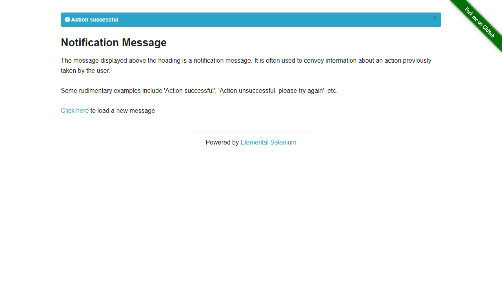

# Held-out Evaluation Verdict — DEMO-606

> **Verdict: ❌ FAIL** — 1 application defect(s) reproduced by the evaluator: the AUT does not satisfy AC-1. Awaiting reviewer confirmation.

| | |
| --- | --- |
| Story | [DEMO-606](https://your-domain.atlassian.net/browse/DEMO-606) — Practice portal — notification copy |
| Application under test | The Internet (UI test playground) (profile `the-internet`) — UI https://the-internet.herokuapp.com |
| Final run | `04-eval2` · 2026-09-26T18:11:14.016Z · 11s |
| Tests | 2 total · 1 passed · 1 failed · 0 flaky · 0 skipped (from 2 scenarios) |
| Held-out integrity | ✅ PRESERVED — 2 requirement assertions identical to the pre-hardening draft |
| Hardening | Tier 3 (`inspect.ts` probes, `run.ts --capture` dry-run, `--repeat-each` stability run). Tier 1/2 browser tools were not loaded in this session. |
| Evaluator | Claude Code — heldout-evaluator skill |
| Generated | 2026-09-26T19:20:46.747Z |

> This verdict is the evaluator's **recommendation**. Each finding below has requirement traceability, reproduction steps and evidence, so a reviewer can confirm or reject it. Nothing has been raised in Jira; the only Jira activity is this report and a summary comment on the story.

## Findings summary

| ID | Suggested severity | Criteria | Test type | Finding | Tests | Reviewer decision |
| --- | --- | --- | --- | --- | --- | --- |
| APP-1 | Minor | AC-1 | functional | Failure notification is misspelled ('unsuccesful') | SCN-001 | ☐ confirm · ☐ reject · ☐ clarify |

## Findings: suspected application defects (1 root cause(s), 1 failing test(s))

### APP-1 · SCN-001 · AC-1 — Failure notification is misspelled ('unsuccesful')

| | |
| --- | --- |
| Suggested severity | Minor |
| Requirement AC-1 | On the Notification Message page (/notification_message_rendered), each click on "Click here" shows exactly one notification, and its text is one of the approved messages in ux-copy.md. |
| Requirement source | story AC-1, ux-copy.md |
| Test type · layer | functional · ui |
| SCN-001: expected (requirement) → actual (AUT) | `[Array []]` → `["Action unsuccesful, please try again"]` |
| Failing step | And every notification text is one of the approved messages |
| Evaluator classification | APPLICATION_DEFECT (reproduced live) |

#### How to reproduce

**Manually (scenario steps):**

1. Given I am on the Notification Message page
2. When I click "Click here" 12 times, reading the notification after each click
3. Then each click showed exactly one notification
4. And every notification text is one of the approved messages

**Automated re-run of the failing test(s):**

```bash
npx tsx .claude/skills/heldout-evaluator/scripts/run.ts DEMO-606 --label repro --grep "SCN-001:"
```

#### Evidence



- [Page/test context at failure](../../runs/04-eval2/artifacts/DEMO-606-tests-demo-606-DE-cd7a9-fication-uses-approved-copy-chromium-retry1/error-context.md)
- Step-by-step trace: `npx playwright show-trace evaluations/DEMO-606/runs/04-eval2/artifacts/DEMO-606-tests-demo-606-DE-cd7a9-fication-uses-approved-copy-chromium-retry1/trace.zip`
- Live re-check by the evaluator: Live re-check on 2026-09-26 (tier 3): 20 clicks → 'Action successful' ×11, 'Action unsuccesful, please try again' ×9 (runs/04-eval2/confirm/sample-20.json)

**Evaluator's analysis:** AC-1 / ux-copy.md: every notification must be approved copy. The failure outcome reads 'Action unsuccesful, please try again' (missing 'c') instead of the approved 'Action unsuccessful, please try again'. It is intermittent by design, because the server picks the outcome at random; sampling 12 clicks per run made it reproduce every time (3/3 stability repeats and the official run). The success copy is correct, and both outcomes occur (AC-2 passes).

**Reviewer decision:** ☐ Confirm as defect · ☐ Not a defect (explain) · ☐ Requirement needs clarification

## Script defects found and repaired (0)

_None in the evaluation runs (mechanics fixed during hardening are in the hardening log)._

## Test results

| Test | Title | Criteria | Type | Result | Classification |
| --- | --- | --- | --- | --- | --- |
| SCN-001 | Every notification uses approved copy | AC-1 | functional | ❌ failed | APPLICATION_DEFECT · APP-1 |
| SCN-002 | Both outcomes occur across repeated clicks | AC-2 | functional | ✅ passed | - |

## Requirement coverage

| Criterion | Requirement | Tests | Result |
| --- | --- | --- | --- |
| AC-1 | On the Notification Message page (/notification_message_rendered), each click on "Click here" shows exactly one notification, and its text is one of the approved messages in ux-copy.md. | SCN-001 | ❌ not met |
| AC-2 | Across repeated clicks, both outcomes (success and failure) can occur. | SCN-002 | ✅ met |

## Traceability matrix

Each row links an acceptance criterion to the requirement source it came from, the scenario that proves it, that scenario's test type and layer, the executed tests, the result and any defect. Every test carries `@AC-n` and `@type:<t>` tags (enforced by the preflight lint).

| Criterion | Source | Scenario | Type | Layer | Tests passed | Result | Defects |
| --- | --- | --- | --- | --- | --- | --- | --- |
| **AC-1** | story AC-1, ux-copy.md | SCN-001 Every notification uses approved copy | functional | ui | 0/1 | ❌ fails requirement | APP-1 |
| **AC-2** | story AC-2, ux-copy.md | SCN-002 Both outcomes occur across repeated clicks | functional | ui | 1/1 | ✅ meets requirement | - |

## Coverage by test type

| Test type | Scenarios | Tests | Passed | Failed | Flaky | Defects |
| --- | --- | --- | --- | --- | --- | --- |
| functional | 2 | 2 | 1 | 1 | 0 | APP-1 |

## Requirement gaps, assumptions and open questions

**Assumptions the evaluation made:**

- The outcome is random per request, so one click cannot prove AC-1/AC-2. The scenario samples 12 clicks: if each outcome has probability ≥ 0.25, the chance of never seeing one of them is ≤ 0.75^12 ≈ 3%, and for the ~50/50 split this story implies it is ≈ 0.02%.
- For AC-2 an outcome is recognised by its meaning (a success message vs a failure message, judged by its opening words), so an off-copy failure message still counts as the failure outcome. Copy correctness is AC-1's concern (one root cause, one failure).

## How this verdict was produced

1. The requirement and its attachments were fetched from Jira and reviewed ([requirement-review.md](../../requirement-review.md) when present), then converted into Gherkin scenarios (`scenarios.feature`). Each scenario is tagged with the acceptance criteria it proves, and API endpoints are declared.
2. Playwright TypeScript tests (UI and API) were written from the scenarios **only**, with no access to the AUT source or developer tests. Expected values were copied verbatim from the requirement.
3. The draft was frozen, then hardened against the live AUT: locators, waits, navigation and API plumbing only. Expected outcomes were never aligned with AUT behaviour (integrity check above).
4. Preflight gates (traceability lint and an AUT healthcheck) passed before the run. Every failure was triaged automatically, then re-investigated live before being classified as an application defect.
5. Script defects were repaired (mechanics only) and the full suite re-run. This verdict reflects the final run.

| Run | Passed | Failed | Flaky |
| --- | --- | --- | --- |
| `01-harden` (hardening dry-run) | 0 | 2 | 0 |
| `02-harden-check` (hardening dry-run) | 1 | 1 | 0 |
| `03-harden-stability` (hardening dry-run) | 3 | 3 | 0 |
| `04-eval2` (final) | 1 | 1 | 0 |

## Artifacts

- Requirement: [requirement/story.md](../../requirement/story.md)
- Scenarios: [scenarios.feature](../../scenarios.feature)
- Tests: [tests/](../../tests/) · frozen draft: [draft/](../../draft/)
- Hardening log: [hardening/hardening-log.md](../../hardening/hardening-log.md)
- Triage: [runs/04-eval2/triage.md](../../runs/04-eval2/triage.md) · JUnit: runs/04-eval2/junit.xml
- HTML report: `npx playwright show-report evaluations/DEMO-606/runs/04-eval2/html`
