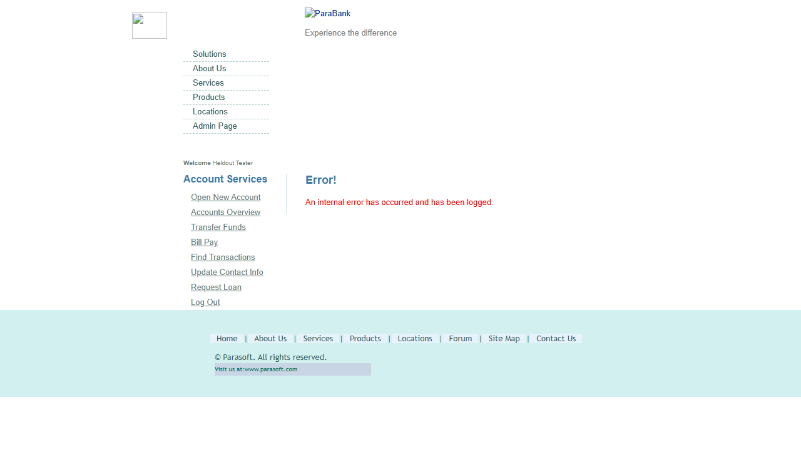

# Held-out Evaluation Verdict — PB-3

> **Verdict: ❌ FAIL** — 2 application defect(s) reproduced by the evaluator: the AUT does not satisfy AC-4, AC-5. Awaiting reviewer confirmation.

| | |
| --- | --- |
| Story | [PB-3](https://your-domain.atlassian.net/browse/PB-3) — Transfer funds between my own accounts |
| Application under test | ParaBank (Parasoft demo bank, UI + REST) (profile `parabank`) — UI https://parabank.parasoft.com/parabank/ · API https://parabank.parasoft.com/parabank/services/bank/ |
| Final run | `05-eval` · 2026-09-27T13:02:32.160Z · 327s |
| Tests | 12 total · 6 passed · 6 failed · 0 flaky · 0 skipped (from 9 scenarios) |
| Held-out integrity | ✅ PRESERVED — 25 requirement assertions identical to the pre-hardening draft |
| Hardening | tier 2 via heldout mcp-probe (register page walk, hardening/tier2/register.md) and tier 3 (heldout inspect walks with setup steps + locator probes, heldout… (see hardening log) |
| Evaluator | Claude Code — heldout-evaluator skill |
| Generated | 2026-09-27T16:56:09.397Z |

> This verdict is the evaluator's **recommendation**. Each finding below has requirement traceability, reproduction steps and evidence, so a reviewer can confirm or reject it. Nothing has been raised in Jira; the only Jira activity is this report and a summary comment on the story.

## Findings summary

| ID | Suggested severity | Criteria | Test type | Finding | Tests | Reviewer decision |
| --- | --- | --- | --- | --- | --- | --- |
| APP-1 | Critical | AC-5 | boundary | Zero and negative amounts are accepted; a negative transfer moves money from B to A | SCN-005.1, SCN-005.2, SCN-006.1, SCN-006.2 | ☐ confirm · ☐ reject · ☐ clarify |
| APP-2 | Major | AC-4 | negative | Transfer Funds page shows an internal error instead of the amount validation messages | SCN-004.1, SCN-004.2 | ☐ confirm · ☐ reject · ☐ clarify |

## Findings: suspected application defects (2 root cause(s), 6 failing test(s))

### APP-1 · SCN-005.1, SCN-005.2, SCN-006.1, SCN-006.2 · AC-5 — Zero and negative amounts are accepted; a negative transfer moves money from B to A

| | |
| --- | --- |
| Suggested severity | Critical |
| Requirement AC-5 | Zero or negative amounts are refused: when the customer transfers 0 or -10.00 from A to B on the Transfer Funds page or through the service, the transfer is refused and the balances of A and B do not change. The PO comment confirms zero and negative amounts must still be refused (story.md#L91). |
| Requirement source | story.md#L58-L66 (AC-5), story.md#L91 |
| Test type · layer | boundary · ui |
| SCN-005.1: expected (requirement) → actual (AUT) | `false` → `true` |
| SCN-005.2: expected (requirement) → actual (AUT) | `false` → `true` |
| SCN-006.1: expected (requirement) → actual (AUT) | `not /^\s*Successfully transferred/` → `"Successfully transferred $0 from account #16230 to account #16341"` |
| SCN-006.2: expected (requirement) → actual (AUT) | `not /^\s*Successfully transferred/` → `"Successfully transferred $-10.00 from account #16674 to account #16785"` |
| SCN-005.2: also failed | [REQ AC-5] GET /accounts/<A> balance unchanged — `415.5` → `425.5` |
| SCN-005.2: also failed | [REQ AC-5] GET /accounts/<B> balance unchanged — `100` → `90` |
| SCN-006.2: also failed | [REQ AC-5] GET /accounts/<A> balance unchanged — `415.5` → `425.5` |
| SCN-006.2: also failed | [REQ AC-5] GET /accounts/<B> balance unchanged — `100` → `90` |
| Failing step | Then the transfer is refused (the page does not show "Transfer Complete!") — bounded 5 s wait for the confirmation |
| Evaluator classification | APPLICATION_DEFECT (reproduced live) |

#### How to reproduce

**Preconditions the test seeded** (tag `hxtzzmg50`; recreate equivalent data before reproducing):

- customer who owns accounts A and B (register + Open New Account): `{"username":"pb3-jtzzmh3i-1","A":"15342","B":"15453"}` · cleanup: none
- read balances before the action (GET /accounts/{accountId}): `[415.5,100]` · cleanup: none

**Manually (scenario steps):**

1. Given a newly registered customer who owns accounts A and B
2. And the balances of A and B are known
3. Given I am signed in as a newly registered customer who owns accounts A and B
4. And the balances of A and B are read with GET /accounts/{accountId}
5. And I am on the Transfer Funds page
6. When I transfer <amount> from A to B
7. Then the transfer is refused (the page does not show "Transfer Complete!")
8. And the balances of A and B do not change

**API pre-steps: SCN-005.1** (preconditions the test established through the API; run these first, then substitute the ids and tokens they return):

P1. `GET /parabank/services/bank/accounts/15342 → 200`

   ```bash
   curl -i -X GET 'https://parabank.parasoft.com/parabank/services/bank/accounts/15342'
   ```

P2. `GET /parabank/services/bank/accounts/15453 → 200`

   ```bash
   curl -i -X GET 'https://parabank.parasoft.com/parabank/services/bank/accounts/15453'
   ```

**Via the API: SCN-005.1** (the exact requests the test sent, in order; secrets replaced by placeholders). Request 2 (⟵) is the one that contradicts the requirement:

1. `GET /parabank/services/bank/accounts/15342 → 200`

   ```bash
   curl -i -X GET 'https://parabank.parasoft.com/parabank/services/bank/accounts/15342'
   ```

2. `GET /parabank/services/bank/accounts/15453 → 200` ⟵

   ```bash
   curl -i -X GET 'https://parabank.parasoft.com/parabank/services/bank/accounts/15453'
   ```

Observed response of request 2 (SCN-005.1):

```json
{"id":15453,"customerId":13322,"type":"CHECKING","balance":100}
```

**API pre-steps: SCN-005.2** (preconditions the test established through the API; run these first, then substitute the ids and tokens they return):

P1. `GET /parabank/services/bank/accounts/15786 → 200`

   ```bash
   curl -i -X GET 'https://parabank.parasoft.com/parabank/services/bank/accounts/15786'
   ```

P2. `GET /parabank/services/bank/accounts/15897 → 200`

   ```bash
   curl -i -X GET 'https://parabank.parasoft.com/parabank/services/bank/accounts/15897'
   ```

**Via the API: SCN-005.2** (the exact requests the test sent, in order; secrets replaced by placeholders). Request 2 (⟵) is the one that contradicts the requirement:

1. `GET /parabank/services/bank/accounts/15786 → 200`

   ```bash
   curl -i -X GET 'https://parabank.parasoft.com/parabank/services/bank/accounts/15786'
   ```

2. `GET /parabank/services/bank/accounts/15897 → 200` ⟵

   ```bash
   curl -i -X GET 'https://parabank.parasoft.com/parabank/services/bank/accounts/15897'
   ```

Observed response of request 2 (SCN-005.2):

```json
{"id":15897,"customerId":13544,"type":"CHECKING","balance":90}
```

**API pre-steps: SCN-006.1** (preconditions the test established through the API; run these first, then substitute the ids and tokens they return):

P1. `GET /parabank/services/bank/accounts/16230 → 200`

   ```bash
   curl -i -X GET 'https://parabank.parasoft.com/parabank/services/bank/accounts/16230'
   ```

P2. `GET /parabank/services/bank/accounts/16341 → 200`

   ```bash
   curl -i -X GET 'https://parabank.parasoft.com/parabank/services/bank/accounts/16341'
   ```

**Via the API: SCN-006.1** (the exact requests the test sent, in order; secrets replaced by placeholders). Request 1 (⟵) is the one that contradicts the requirement:

1. `POST /parabank/services/bank/transfer → 200` ⟵

   ```bash
   curl -i -X POST 'https://parabank.parasoft.com/parabank/services/bank/transfer?fromAccountId=16230&toAccountId=16341&amount=0'
   ```

2. `GET /parabank/services/bank/accounts/16230 → 200`

   ```bash
   curl -i -X GET 'https://parabank.parasoft.com/parabank/services/bank/accounts/16230'
   ```

3. `GET /parabank/services/bank/accounts/16341 → 200`

   ```bash
   curl -i -X GET 'https://parabank.parasoft.com/parabank/services/bank/accounts/16341'
   ```

Observed response of request 1 (SCN-006.1):

```json
Successfully transferred $0 from account #16230 to account #16341
```

**API pre-steps: SCN-006.2** (preconditions the test established through the API; run these first, then substitute the ids and tokens they return):

P1. `GET /parabank/services/bank/accounts/16674 → 200`

   ```bash
   curl -i -X GET 'https://parabank.parasoft.com/parabank/services/bank/accounts/16674'
   ```

P2. `GET /parabank/services/bank/accounts/16785 → 200`

   ```bash
   curl -i -X GET 'https://parabank.parasoft.com/parabank/services/bank/accounts/16785'
   ```

**Via the API: SCN-006.2** (the exact requests the test sent, in order; secrets replaced by placeholders). Request 1 (⟵) is the one that contradicts the requirement:

1. `POST /parabank/services/bank/transfer → 200` ⟵

   ```bash
   curl -i -X POST 'https://parabank.parasoft.com/parabank/services/bank/transfer?fromAccountId=16674&toAccountId=16785&amount=-10.00'
   ```

2. `GET /parabank/services/bank/accounts/16674 → 200`

   ```bash
   curl -i -X GET 'https://parabank.parasoft.com/parabank/services/bank/accounts/16674'
   ```

3. `GET /parabank/services/bank/accounts/16785 → 200`

   ```bash
   curl -i -X GET 'https://parabank.parasoft.com/parabank/services/bank/accounts/16785'
   ```

Observed response of request 1 (SCN-006.2):

```json
Successfully transferred $-10.00 from account #16674 to account #16785
```

**Automated re-run of the failing test(s):**

```bash
npm run heldout -- run PB-3 --label repro --grep "SCN-005\.1:"
npm run heldout -- run PB-3 --label repro --grep "SCN-005\.2:"
npm run heldout -- run PB-3 --label repro --grep "SCN-006\.1:"
npm run heldout -- run PB-3 --label repro --grep "SCN-006\.2:"
```

#### Evidence

- [Page/test context at failure](runs/05-eval/artifacts/PB-3-tests-pb-3-PB-3-Trans-602d9--the-Transfer-Funds-page-0--chromium-retry1/error-context.md)
- Step-by-step trace: `npx playwright show-trace evaluations/PB-3/runs/05-eval/artifacts/PB-3-tests-pb-3-PB-3-Trans-602d9--the-Transfer-Funds-page-0--chromium-retry1/trace.zip`
- Live re-check by the evaluator: Replayed live 2026-09-27: tier 3 api-probe chain confirm/api-ac5.md (A 415.5→415.5 after 0; 415.5→425.5 and B 100→90 after -10.00, both 200 'Successfully transferred'); tier 3 inspect confirm/ui-amountx0.md and confirm/ui-amountx_10_00.md ('Transfer Complete!' visible). Same in runs 01, 03, 04, 05.

**Evaluator's analysis:** AC-5 (story.md#L58-L66, re-confirmed by the PO at L91) requires 0 and -10.00 to be refused on the page and through the service with balances unchanged. Live, the page shows 'Transfer Complete!' ('$0.00 has been transferred…', '-$10.00 has been transferred…') and the service answers 200 'Successfully transferred $0 …' / 'Successfully transferred $-10.00 …'. For -10.00 the balance of A rises by 10.00 and B falls by 10.00 (money moved in reverse). Declared endpoint, correct parameters; nothing script-side.

**Reviewer decision:** ☐ Confirm as defect · ☐ Not a defect (explain) · ☐ Requirement needs clarification

### APP-2 · SCN-004.1, SCN-004.2 · AC-4 — Transfer Funds page shows an internal error instead of the amount validation messages

| | |
| --- | --- |
| Suggested severity | Major |
| Requirement AC-4 | Amount missing or not a number on the Transfer Funds page: when the customer enters "<amount>" as the amount and presses Transfer, the Transfer Funds form stays on screen with the message "<message>" and no balance changes (empty amount: "The amount cannot be empty."; abc: "Please enter a valid amount."). The PO comment confirms the input messages stay as written (story.md#L91). |
| Requirement source | story.md#L48-L56 (AC-4) |
| Test type · layer | negative · ui |
| SCN-004.1: expected (requirement) → actual (AUT) | `visible` → `hidden` |
| SCN-004.2: expected (requirement) → actual (AUT) | `visible` → `hidden` |
| SCN-004.1: also failed | [REQ AC-4] Transfer Funds form stays on screen — `visible` → `` |
| SCN-004.2: also failed | [REQ AC-4] Transfer Funds form stays on screen — `visible` → `` |
| Failing step | Then the Transfer Funds form stays on screen with the message "The amount cannot be empty." |
| Evaluator classification | APPLICATION_DEFECT (reproduced live) |

#### How to reproduce

**Preconditions the test seeded** (tag `hxtxxe110`; recreate equivalent data before reproducing):

- customer who owns accounts A and B (register + Open New Account): `{"username":"pb3-jtxxe3ia-1","A":"14454","B":"14565"}` · cleanup: none
- read balances before the action (GET /accounts/{accountId}): `[415.5,100]` · cleanup: none

**Manually (scenario steps):**

1. Given a newly registered customer who owns accounts A and B
2. And the balances of A and B are known
3. Given I am signed in as a newly registered customer who owns accounts A and B
4. And the balances of A and B are read with GET /accounts/{accountId}
5. And I am on the Transfer Funds page
6. When I enter "<amount>" as the amount and press Transfer
7. Then the Transfer Funds form stays on screen with the message "<message>"
8. And the balances of A and B do not change

**API pre-steps: SCN-004.1** (preconditions the test established through the API; run these first, then substitute the ids and tokens they return):

P1. `GET /parabank/services/bank/accounts/14454 → 200`

   ```bash
   curl -i -X GET 'https://parabank.parasoft.com/parabank/services/bank/accounts/14454'
   ```

P2. `GET /parabank/services/bank/accounts/14565 → 200`

   ```bash
   curl -i -X GET 'https://parabank.parasoft.com/parabank/services/bank/accounts/14565'
   ```

**Via the API: SCN-004.1** (the exact requests the test sent, in order; secrets replaced by placeholders). Request 2 (⟵) is the one that contradicts the requirement:

1. `GET /parabank/services/bank/accounts/14454 → 200`

   ```bash
   curl -i -X GET 'https://parabank.parasoft.com/parabank/services/bank/accounts/14454'
   ```

2. `GET /parabank/services/bank/accounts/14565 → 200` ⟵

   ```bash
   curl -i -X GET 'https://parabank.parasoft.com/parabank/services/bank/accounts/14565'
   ```

Observed response of request 2 (SCN-004.1):

```json
{"id":14565,"customerId":12878,"type":"CHECKING","balance":100}
```

**API pre-steps: SCN-004.2** (preconditions the test established through the API; run these first, then substitute the ids and tokens they return):

P1. `GET /parabank/services/bank/accounts/14898 → 200`

   ```bash
   curl -i -X GET 'https://parabank.parasoft.com/parabank/services/bank/accounts/14898'
   ```

P2. `GET /parabank/services/bank/accounts/15009 → 200`

   ```bash
   curl -i -X GET 'https://parabank.parasoft.com/parabank/services/bank/accounts/15009'
   ```

**Via the API: SCN-004.2** (the exact requests the test sent, in order; secrets replaced by placeholders). Request 2 (⟵) is the one that contradicts the requirement:

1. `GET /parabank/services/bank/accounts/14898 → 200`

   ```bash
   curl -i -X GET 'https://parabank.parasoft.com/parabank/services/bank/accounts/14898'
   ```

2. `GET /parabank/services/bank/accounts/15009 → 200` ⟵

   ```bash
   curl -i -X GET 'https://parabank.parasoft.com/parabank/services/bank/accounts/15009'
   ```

Observed response of request 2 (SCN-004.2):

```json
{"id":15009,"customerId":13100,"type":"CHECKING","balance":100}
```

**Automated re-run of the failing test(s):**

```bash
npm run heldout -- run PB-3 --label repro --grep "SCN-004\.1:"
npm run heldout -- run PB-3 --label repro --grep "SCN-004\.2:"
```

#### Evidence



- [Page/test context at failure](runs/05-eval/artifacts/PB-3-tests-pb-3-PB-3-Trans-eabcd-unds-form-on-screen-amount--chromium-retry1/error-context.md)
- Step-by-step trace: `npx playwright show-trace evaluations/PB-3/runs/05-eval/artifacts/PB-3-tests-pb-3-PB-3-Trans-eabcd-unds-form-on-screen-amount--chromium-retry1/trace.zip`
- Live re-check by the evaluator: Replayed live 2026-09-27 (tier 3, heldout inspect, fresh customer, A=17673 B=17784): confirm/ui-amountx.md (empty) and confirm/ui-amountxabc.md (abc): heading 'Error!' visible, #amount hidden, message elements present but not visible. Same in runs 01, 03, 04, 05 (both attempts).

**Evaluator's analysis:** The requirement (AC-4, story.md#L48-L56; PO comment L91 keeps the messages) says an empty or non-numeric amount keeps the Transfer Funds form on screen with 'The amount cannot be empty.' / 'Please enter a valid amount.'. Live, pressing Transfer with an empty amount or 'abc' replaces the page with 'Error! An internal error has occurred and has been logged.'; the form is gone and both messages exist only as hidden elements. Seeds, locators and the entry point worked (form filled, accounts selected); balances stay unchanged, so only the message/form outcome fails.

**Reviewer decision:** ☐ Confirm as defect · ☐ Not a defect (explain) · ☐ Requirement needs clarification

## Script defects found and repaired (0)

_None confirmed with triage (other mechanics fixed during hardening are in the hardening log)._

## Test results

| Test | Title | Criteria | Type | Result | Classification |
| --- | --- | --- | --- | --- | --- |
| SCN-001 | The customer transfers 25.50 from A to B on the Transfer Funds page | AC-1 | functional | ✅ passed | - |
| SCN-002 | The REST service transfers 12.34 from A to B | AC-2 | functional | ✅ passed | - |
| SCN-003 | A transfer made on the page is listed as a transaction on both accounts | AC-3 | integration | ✅ passed | - |
| SCN-004.1 | An empty or non-numeric amount keeps the Transfer Funds form on screen (amount "") | AC-4 | negative | ❌ failed | APPLICATION_DEFECT · APP-2 |
| SCN-004.2 | An empty or non-numeric amount keeps the Transfer Funds form on screen (amount "abc") | AC-4 | negative | ❌ failed | APPLICATION_DEFECT · APP-2 |
| SCN-005.1 | A zero or negative amount is refused on the Transfer Funds page (0) | AC-5 | boundary | ❌ failed | APPLICATION_DEFECT · APP-1 |
| SCN-005.2 | A zero or negative amount is refused on the Transfer Funds page (-10.00) | AC-5 | boundary | ❌ failed | APPLICATION_DEFECT · APP-1 |
| SCN-006.1 | A zero or negative amount is refused by the REST service (0) | AC-5 | boundary | ❌ failed | APPLICATION_DEFECT · APP-1 |
| SCN-006.2 | A zero or negative amount is refused by the REST service (-10.00) | AC-5 | boundary | ❌ failed | APPLICATION_DEFECT · APP-1 |
| SCN-007 | The REST service completes a transfer of 1000.00, more than the balance of A | AC-6 | boundary | ✅ passed | - |
| SCN-008 | The Transfer Funds page completes a transfer of 1000.00, more than the balance of A | AC-6 | boundary | ✅ passed | - |
| SCN-009 | The REST service refuses an unknown destination account | AC-7 | negative | ✅ passed | - |

## Requirement coverage

| Criterion | Requirement | Tests | Result |
| --- | --- | --- | --- |
| AC-1 | Transfer on the Transfer Funds page: when the customer transfers 25.50 from A to B on the Transfer Funds page, the page shows "Transfer Complete!" and "$25.50 has been transferred from account #<A> to account #<B>."; Accounts Overview shows the balance of A lower by $25.50 and the balance of B higher by $25.50, and the total shown on Accounts Overview is unchanged. | SCN-001 | ✅ met |
| AC-2 | Transfer through the REST service: called with fromAccountId A, toAccountId B and amount 12.34, the service answers 200 with the text "Successfully transferred $12.34 from account #<A> to account #<B>"; GET /accounts/<A> returns a balance lower by 12.34 and GET /accounts/<B> a balance higher by 12.34. | SCN-002 | ✅ met |
| AC-3 | Transfers are listed as transactions on both accounts: after the customer transferred 25.50 from A to B on the Transfer Funds page, GET /accounts/<A>/transactions contains a "Debit" of 25.50 described "Funds Transfer Sent", GET /accounts/<B>/transactions contains a "Credit" of 25.50 described "Funds Transfer Received", and the Account Activity of A on the web page lists "Funds Transfer Sent" with $25.50 in the Debit (-) column. | SCN-003 | ✅ met |
| AC-4 | Amount missing or not a number on the Transfer Funds page: when the customer enters "<amount>" as the amount and presses Transfer, the Transfer Funds form stays on screen with the message "<message>" and no balance changes (empty amount: "The amount cannot be empty."; abc: "Please enter a valid amount."). The PO comment confirms the input messages stay as written (story.md#L91). | SCN-004.1, SCN-004.2 | ❌ not met |
| AC-5 | Zero or negative amounts are refused: when the customer transfers 0 or -10.00 from A to B on the Transfer Funds page or through the service, the transfer is refused and the balances of A and B do not change. The PO comment confirms zero and negative amounts must still be refused (story.md#L91). | SCN-005.1, SCN-005.2, SCN-006.1, SCN-006.2 | ❌ not met |
| AC-6 | Amount larger than the balance of the source account, as replaced by the Product Owner comment of 2026-09-26 (story.md#L86-L89): given the balance of A is lower than 1000.00, a transfer of 1000.00 from A to B completes like any other transfer (same confirmation on the page, 200 from the service); the balance of A then goes negative by the difference and B is credited with the full amount. | SCN-007, SCN-008 | ✅ met |
| AC-7 | Unknown destination account: called with fromAccountId A, toAccountId 99999999 and amount 5.00, the service answers 400 with the text "Could not find account number <A> and/or 99999999" and the balance of A does not change. | SCN-009 | ✅ met |

## Traceability matrix

Each row links an acceptance criterion to the requirement source it came from, the scenario that proves it, that scenario's test type and layer, the executed tests, the result and any defect. Every test carries `@AC-n` and `@type:<t>` tags (enforced by the preflight lint).

| Criterion | Source | Scenario | Type | Layer | Tests passed | Result | Defects |
| --- | --- | --- | --- | --- | --- | --- | --- |
| **AC-1** | story.md#L30-L35 (AC-1) | SCN-001 The customer transfers 25.50 from A to B on the Transfer Funds page | functional | ui | 1/1 | ✅ meets requirement | - |
| **AC-2** | story.md#L37-L40 (AC-2) | SCN-002 The REST service transfers 12.34 from A to B | functional | api | 1/1 | ✅ meets requirement | - |
| **AC-3** | story.md#L42-L46 (AC-3) | SCN-003 A transfer made on the page is listed as a transaction on both accounts | integration | e2e | 1/1 | ✅ meets requirement | - |
| **AC-4** | story.md#L48-L56 (AC-4) | SCN-004 An empty or non-numeric amount keeps the Transfer Funds form on screen | negative | ui | 0/2 | ❌ fails requirement | APP-2 |
| **AC-5** | story.md#L58-L66 (AC-5), story.md#L91 | SCN-005 A zero or negative amount is refused on the Transfer Funds page | boundary | ui | 0/2 | ❌ fails requirement | APP-1 |
| ↳ | story.md#L58-L66 (AC-5), story.md#L91 | SCN-006 A zero or negative amount is refused by the REST service | boundary | api | 0/2 | ❌ fails requirement | APP-1 |
| **AC-6** | story.md#L68 (AC-6), PO comment story.md#L86-L89 | SCN-007 The REST service completes a transfer of 1000.00, more than the balance of A | boundary | api | 1/1 | ✅ meets requirement | - |
| ↳ | story.md#L68 (AC-6), PO comment story.md#L86-L89 | SCN-008 The Transfer Funds page completes a transfer of 1000.00, more than the balance of A | boundary | e2e | 1/1 | ✅ meets requirement | - |
| **AC-7** | story.md#L74-L77 (AC-7) | SCN-009 The REST service refuses an unknown destination account | negative | api | 1/1 | ✅ meets requirement | - |

## Coverage by test type

| Test type | Scenarios | Tests | Passed | Failed | Flaky | Defects |
| --- | --- | --- | --- | --- | --- | --- |
| boundary | 4 | 6 | 2 | 4 | 0 | APP-1 |
| functional | 2 | 2 | 2 | 0 | 0 | - |
| integration | 1 | 1 | 1 | 0 | 0 | - |
| negative | 2 | 3 | 1 | 2 | 0 | APP-2 |

## Requirement gaps, assumptions and open questions

**Elements the story did not state, and how they were filled** ([requirement-contract.md](requirement-contract.md)):

| Gap | Missing element | Kind | Affects | Resolution |
| --- | --- | --- | --- | --- |
| G1 | AC-6 as written (story.md#L68-L72: a transfer larger than the balance is refused because of insufficient funds, balances unchanged) conflicts with the PO comment (story.md#L86-L89: it completes, the source goes negative, the destination is credited in full) | expected behaviour | AC-6 | found elsewhere in the requirement: the transfer completes (same confirmation on the page, 200 from the service); A goes negative by the difference and B is credited with the full 1000.00 |
| G2 | what "the transfer is refused" looks like for amount 0 and -10.00: the message on the Transfer Funds page, and the HTTP status and body from the service | expected behaviour | AC-5 | ❓ open |
| G3 | whether GET /accounts/{accountId} and GET /accounts/{accountId}/transactions sit under the same REST service base /parabank/services/bank as the transfer service, and how the transfer parameters are sent (query string as written, or form body) | how to exercise | AC-2, AC-3, AC-5, AC-6, AC-7 | discovered from the AUT (mechanics only): all three endpoints under the REST base /parabank/services/bank (the profile's apiBaseURL); transfer parameters sent in the query string |
| G4 | authentication for the REST service calls (POST transfer and the GET read-backs): whether credentials are needed and how they are sent | how to exercise | AC-2, AC-3, AC-5, AC-6, AC-7 | discovered from the AUT (mechanics only): no credentials are needed for the REST calls (sent without auth) |
| G5 | UI mechanics: registration page and fields, signing in, the "Open New Account" controls, the Transfer Funds form controls (amount, from and to accounts, the Transfer button), the Accounts Overview route and how balances and the total are shown, and the Account Activity page with its Debit (-) column | how to exercise | AC-1, AC-3, AC-4, AC-5, AC-6 | discovered from the AUT (mechanics only): register.htm (ids customer.*), openaccount.htm (#fromAccountId, 'Open New Account', #newAccountId), transfer.htm (#amount, #fromAccountId, #toAccountId, 'Transfer'), overview.htm (#accountTable with a Total row), activity.htm?id=<account> (#transactionTable) |
| G6 | how a scenario obtains the account numbers of A and B (and any customer id) for the customer it registered | how to exercise | AC-1, AC-2, AC-3, AC-4, AC-5, AC-6, AC-7 | discovered from the AUT (mechanics only): A = the first account link on Accounts Overview right after registration; B = #newAccountId after 'Open New Account' |
| G7 | JSON field names: the balance in GET /accounts/{accountId}, and the type ("Debit"/"Credit"), amount and description in GET /accounts/{accountId}/transactions | how to exercise | AC-2, AC-3, AC-5, AC-6, AC-7 | discovered from the AUT (mechanics only): GET /accounts/{accountId} -> balance; GET /accounts/{accountId}/transactions -> array of {type, amount, description} |
| G8 | how to make sure the balance of A is lower than 1000.00 for AC-6 (a newly registered customer's starting balance, and what opening B moves, are not stated) | how to exercise | AC-6 | discovered from the AUT (mechanics only): no extra step needed: A's balance after registration and opening B is below 1000.00; the test asserts it as a precondition (BLOCKED otherwise) |

**Open questions for the PO** (untested unless a scenario needing clarification below covers it):

- ❓ G2 — what "the transfer is refused" looks like for amount 0 and -10.00: the message on the Transfer Funds page, and the HTTP status and body from the service

**Assumptions the evaluation made:**

- G1 — AC-6 is tested as replaced by the PO comment of 2026-09-26 (an overdrawing own-account transfer completes; A goes negative by the difference, B is credited in full).
- AC-6 through the service — "the same confirmation as any other transfer" is the AC-2 sentence for the amount 1000.00; the story states no format for amounts of 1000 or more, so "$1000.00" and "$1,000.00" are both accepted.
- each successful transfer asserts only the confirmation its own AC states (AC-1/AC-6 page: "Transfer Complete!"; AC-2/AC-6 service: 200 + confirmation text); AC-3 does not re-assert the AC-1 confirmation (one root cause, one failure).
- G2 — for amounts 0 and -10.00 no message, status code or body is asserted (not asserted); "refused" is checked as "no success confirmation" plus "balances of A and B unchanged".

Full review: [requirement-review.md](requirement-review.md)

## How this verdict was produced

1. The requirement and its attachments were fetched from Jira and reviewed ([requirement-review.md](requirement-review.md) when present), then converted into Gherkin scenarios (`scenarios.feature`). Each scenario is tagged with the acceptance criteria it proves, and API endpoints are declared.
2. Playwright TypeScript tests (UI and API) were written from the scenarios **only**, with no access to the AUT source or developer tests. Expected values were copied verbatim from the requirement.
3. The draft was frozen, then hardened against the live AUT: locators, waits, navigation and API plumbing only. Expected outcomes were never aligned with AUT behaviour (integrity check above).
4. Preflight gates (traceability lint and an AUT healthcheck) passed before the run. Every failure was triaged automatically, then re-investigated live before being classified as an application defect.
5. No script defect needed repairing after hardening. This verdict reflects the final run.

| Run | Passed | Failed | Flaky |
| --- | --- | --- | --- |
| `01-harden` (hardening dry-run) | 4 | 8 | 0 |
| `02-harden` (hardening dry-run) | 2 | 0 | 0 |
| `03-harden-stability` (hardening dry-run) | 8 | 16 | 0 |
| `04-harden-stability` (hardening dry-run) | 12 | 12 | 0 |
| `05-eval` (final) | 6 | 6 | 0 |

## Artifacts

- Requirement: [requirement/story.md](requirement/story.md)
- Requirement review: [requirement-review.md](requirement-review.md)
- Scenarios: [scenarios.feature](scenarios.feature)
- Tests: [tests/](tests/) · frozen draft: [draft/](draft/)
- Hardening log: [hardening/hardening-log.md](hardening/hardening-log.md)
- Triage: [runs/05-eval/triage.md](runs/05-eval/triage.md) · JUnit: runs/05-eval/junit.xml
- HTML report: `npx playwright show-report evaluations/PB-3/runs/05-eval/html`
